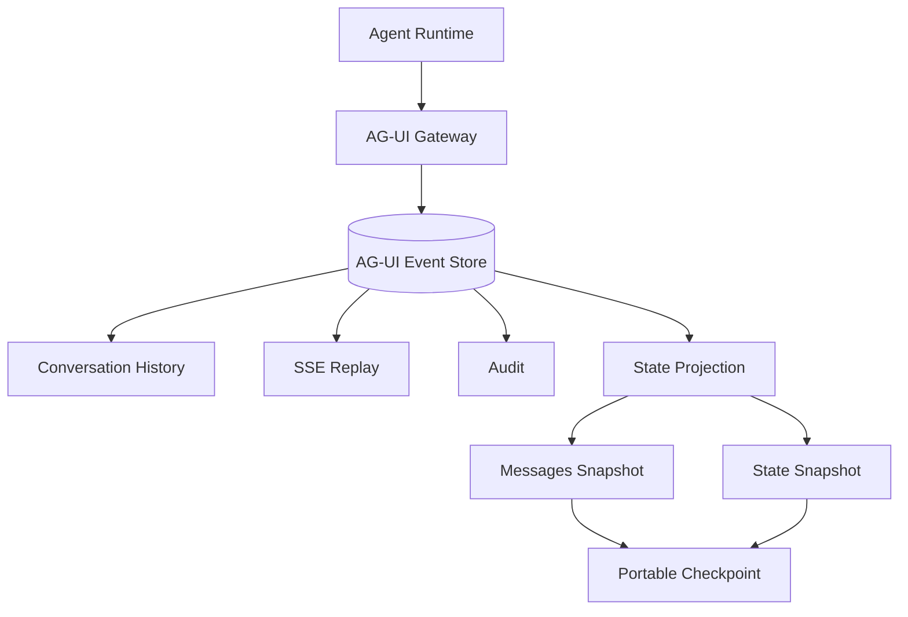
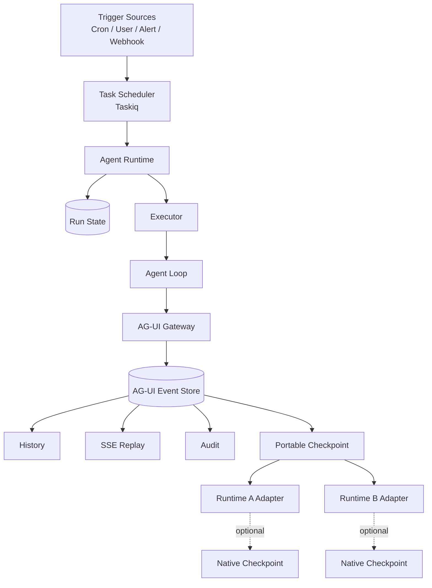

# Agent Runtime 的异步化：Task、Run 与统一 Checkpoint

在设计 Agent Platform 时，一个很自然的想法是：Agent 执行时间越来越长，那么把它扔进异步任务队列不就行了吗？

例如：

```text
POST /runs
    ↓
Taskiq
    ↓
Worker
    ↓
await agent.run()
```

对于一个几十秒、几分钟即可完成的 Agent，这个方案完全成立。Taskiq 本身就是面向分布式函数执行的异步任务框架，支持同步和异步函数，也提供独立的定时调度能力。([Taskiq][1])

但当 Agent Run 开始持续几十分钟、几个小时甚至半天，同时还要支持 HITL、暂停恢复、流式事件、Runtime 重启和多 Executor 部署时，问题发生了变化：

**我们需要异步化的已经不只是一个函数，而是一个长期存在的执行实体。**

这也是 Task 和 Run 必须分开的原因。

# 1. Task 不等于 Run

传统异步任务框架关注的问题是：

```text
这个函数什么时候执行？
哪个 Worker 执行？
失败以后要不要重试？
任务结果是什么？
```

它的一等对象是：

```text
Task / Job
```

而 Agent Runtime 关注的问题却是：

```text
这个 Agent 当前执行到哪里？
已经调用了哪些工具？
现在是不是在等待 HITL？
执行它的 Runtime 挂了以后谁接管？
怎样从之前的位置继续？
```

它的一等对象应该是：

```text
Run
```

因此更准确的抽象应该是：

> **Task 是一次可调度的执行尝试，Run 是一个持久化、可恢复的 Agent 执行实体。**

普通情况下，两者看起来可能是一对一：

```text
Run-123
   ↓
Task #1
   ↓
completed
```

但只要开始支持长生命周期 Agent，这种关系就会自然变成：

```text
                  Run-123
                     │
          ┌──────────┼──────────┐
          ▼          ▼          ▼
       Task #1    Task #2    Task #3
        start      resume     recovery
```

例如 Agent 执行了一段时间之后需要用户确认：

```text
Run-123
   ↓
Task #1
   ↓
running
   ↓
checkpoint
   ↓
waiting_hitl
```

Task #1 到这里完全可以结束，计算资源也应该释放。

几个小时后用户回来确认：

```text
Run-123
   ↓
Task #2
   ↓
load checkpoint
   ↓
running
   ↓
completed
```

从业务角度看，它始终是同一个 `Run-123`。

变化的只是这个 Run 被执行了几次。

这种思想并不是 Agent 特有。Durable Execution 系统本质上也是把逻辑 Workflow Execution 和某一次 Worker 执行解耦。Temporal 例如把 Event History 持久化，用它在进程或 Worker 故障后恢复 Workflow 状态，而不是要求原来的 Worker 一直存活。([Temporal 文档][2])

因此，一个很重要的 Agent Runtime 架构原则可以确定下来：

> **Taskiq 管 Task 的调度和执行尝试，Agent Runtime 管 Run 的持久化生命周期。**

# 2. Scheduler 决定 WHEN，Runtime 决定 HOW

这个边界在定时 Agent 场景下尤其明显。

假设有一个运维 Agent，每十分钟执行一次巡检。

最简单的架构不是让 Taskiq 自己承担整个 Agent Run：

```text
Taskiq Worker
    ↓
Agent 跑三个小时
    ↓
Worker 一直被占着
```

而应该是：

```text
Taskiq Scheduler
      │
      │ 每 10 分钟
      ▼
trigger_ops_agent
      │
      ▼
Agent Runtime
      │
      ▼
Create Run
      │
      ▼
Executor
```

Taskiq 做的事情非常薄：

```python
@broker.task
async def trigger_ops_agent():
    await runtime.create_run(
        agent_id="ops-agent",
        trigger="schedule",
    )
```

这个 Task 甚至可以在几十毫秒内结束。

接下来 Agent 究竟：

```text
执行 30 秒
执行 30 分钟
执行 5 小时
进入 waiting_hitl
被暂停
被另一个 Executor 恢复
```

全部属于 Agent Runtime。

这样就得到另一个非常有用的原则：

> **Scheduler decides WHEN，Runtime decides HOW。**

Taskiq 负责：

```text
什么时候启动
定时触发
异步任务
GC
probe
evaluation fan-out
aggregation
recovery scan
```

Agent Runtime 负责：

```text
Run 生命周期
Agent Loop
Executor
Streaming
HITL
cancel
checkpoint
resume
crash recovery
```

这也意味着，未来 Agent 的触发来源完全可以扩展，而 Runtime 不需要变化：

```text
Cron ──────────────┐
Prometheus Alert ──┤
ITSM Event ────────┤
Webhook ───────────┤
User ──────────────┤
Kafka ─────────────┤
                    ▼
               Agent Runtime
                    │
                    ▼
                   Run
```

**Trigger 和 Execution 从此解耦。**

# 3. 真正困难的是 Run 如何持久化

如果 Run 只是一个 Python coroutine：

```text
HTTP Request
    ↓
async agent.run()
```

那么它实际上仍然依赖某个进程的生命。

进程一旦发生：

```text
滚动发布
OOM
机器宕机
Pod 重启
```

Run 也就随之消失。

因此真正分布式的 Agent Runtime 至少要维护一个独立的 Run State：

```text
AgentRun

id
status

executor_id
heartbeat_at
lease_until

current_step
checkpoint

created_at
started_at
completed_at
```

这里最关键的是：

```text
Run identity
+
execution state
+
executor ownership
```

例如：

```text
Runtime-A claim Run-123

executor_id = runtime-a
lease_until = 10:05
```

Executor 周期性 heartbeat：

```text
10:01 → lease_until = 10:06
10:02 → lease_until = 10:07
10:03 → lease_until = 10:08
```

如果 Runtime-A 突然消失：

```text
heartbeat 停止
      ↓
lease expired
      ↓
Run-123 被判断为 orphan
      ↓
recovery scan
      ↓
Runtime-B claim
      ↓
resume
```

这样才能真正做到：

> **Runtime 进程可以死，Run 不能因此消失。**

这也是为什么简单把 `agent.run()` 套一个 Taskiq decorator，并没有真正解决 Agent Runtime 的分布式问题。

它只是把执行从 API Server 搬到了另一个 Worker。

# 4. AG-UI Event Store 可以进一步成为统一 Checkpoint 基础

当 Runtime 状态开始独立维护后，会遇到下一个问题：

**不同 Agent Runtime 的 checkpoint 要不要各自保存一套？**

例如：

```text
LangGraph checkpoint
Runtime A checkpoint
Runtime B checkpoint
Conversation history
SSE replay history
Tool call history
Audit log
```

如果每个组件都建立自己的历史存储，很快就会产生大量重复状态。

这里 AG-UI 提供了一个很有意思的统一层。

AG-UI 本身采用事件驱动模型，Events 是 Agent 与前端之间通信的基本单元。([Agent User Interaction Protocol][3])

更关键的是，AG-UI 官方的 Serialization 规范已经明确支持：

**persist and restore the event stream。**

序列化后的 Event Stream 可以用于恢复 session，同时支持持久化、replay、branch/time travel 和 stream compaction。([Agent User Interaction Protocol][4])

因此，如果 Gateway 已经统一保存：

```text
RUN_STARTED
STEP_STARTED

TEXT_MESSAGE_*
TOOL_CALL_*
TOOL_CALL_RESULT

STATE_DELTA
STATE_SNAPSHOT
MESSAGES_SNAPSHOT

RUN_FINISHED
```

那么这份数据实际上已经不只是“聊天历史”。

它可以升级为：

> **Agent Platform 的统一 Execution Log。**

架构就可以变成：



这里必须区分两个概念：

```text
AG-UI Event Store
=
完整 Execution Log
```

而：

```text
Checkpoint
=
Execution Log 上某一个可以安全恢复的位置
```

不是每个 Event 都是 checkpoint。

例如：

```text
seq 100  TEXT_MESSAGE_END
seq 101  TOOL_CALL_START
seq 102  TOOL_CALL_ARGS
seq 103  TOOL_CALL_END
seq 104  TOOL_CALL_RESULT
seq 105  STATE_SNAPSHOT
seq 106  MESSAGES_SNAPSHOT

------------------------------
Checkpoint CP-27 @ seq 106
------------------------------

seq 107  STEP_STARTED
...
```

恢复 Run 时：

```text
寻找最新 Checkpoint
        ↓
读取 MessagesSnapshot
        +
读取 StateSnapshot
        ↓
Replay 后续 Events
        ↓
继续执行
```

本质上就是：

```text
Snapshot + Event Replay
```

这种模型和 Temporal 用 durable Event History 恢复执行状态的思想也非常接近。([Temporal 文档][5])

# 5. Portable Checkpoint 与 Native Checkpoint

AG-UI 作为统一恢复层还有一个非常重要的边界：

**AG-UI State 并不等于 Runtime 的全部内部状态。**

AG-UI 的定位首先是标准化 Agent 与用户侧应用之间的交互、消息和共享状态。([Agent User Interaction Protocol][6])

因此它可以很好地表达：

```text
messages
shared state
tool history
interaction history
interrupt context
```

但未必能表达：

```text
Python coroutine stack
LangGraph node cursor
executor internal stack
sandbox process memory
执行到一半的数据库 transaction
正在进行中的 Tool side effect
```

这些属于 Runtime-specific execution state。

所以更合理的 checkpoint 分层不是要求所有 Runtime 完全抛弃自己的 checkpoint，而是：

```text
Portable Checkpoint
        +
Native Checkpoint（Optional）
```

AG-UI Interrupt 规范甚至非常明确地指出：

**Framework-native checkpointing 是一种 implementation optimization，而不是 protocol contract。** ([Agent User Interaction Protocol][7])

这句话实际上非常重要。

它意味着平台可以把：

```text
MessagesSnapshot
StateSnapshot
Event History
Interrupt Context
```

定义成统一的恢复契约。

而具体 Runtime 如果拥有更精确的执行状态，可以再提供：

```text
native_checkpoint_ref
```

于是一个平台级 checkpoint 可以设计成：

```text
AGUICheckpoint

run_id
thread_id
event_seq

messages_snapshot
state_snapshot

runtime_type
runtime_version

native_checkpoint_ref?   # optional
```

恢复时：

```text
                AG-UI Checkpoint
                       │
            ┌──────────┴──────────┐
            │                     │
 native_checkpoint_ref       no native CP
            │                     │
            ▼                     ▼
     Native Resume        Portable Resume
            │                     │
            └──────────┬──────────┘
                       ▼
                     Run
```

这样就形成了一个非常有价值的平台边界：

> **AG-UI Portable Checkpoint 是平台 Contract；Runtime Native Checkpoint 是实现细节。**

不同 Agent Runtime 接入平台，只需要实现自己的 Adapter：

```python
class AgentRuntime:

    async def start(self, run_id, input):
        ...

    async def resume(self, checkpoint):
        ...

    async def cancel(self, run_id):
        ...
```

LangGraph 可以有 LangGraphAdapter，自研 Runtime 可以有 CustomRuntimeAdapter。

但 Gateway、Conversation History、SSE Replay、Audit、Checkpoint 都不需要为每种 Runtime 重写。

当然，这并不意味着：

```text
Runtime A 跑到任意指令位置
        ↓
Runtime B
可以无损接着执行
```

AG-UI 并没有定义不同 Runtime 的内部执行机器。

因此 Portable Checkpoint 应该发生在明确的 **Safe Resume Boundary**：

```text
LLM Turn 完成          ✅
Tool Result 已持久化   ✅
Step 完成              ✅
HITL Interrupt         ✅

Tool 执行一半          ❌
Token 输出一半         ❌
数据库事务一半         ❌
coroutine 任意 await 点 ❌
```

统一的是**逻辑执行状态**，而不是 Runtime 的进程内存。

---

# 结语

最终，一个比较完整的 Agent Runtime 架构可以收敛成：



从这个架构里，可以得到几条非常值得长期保留的原则。

**Task ≠ Run。**

Task 是一次执行尝试，Run 是持久化执行实体。

**Scheduler decides WHEN，Runtime decides HOW。**

异步任务框架负责调度，Agent Runtime 负责生命周期。

**Run State belongs to Runtime。**

不要把 Task Queue 的 task state 当成 Agent Run state。

**AG-UI Event Store = Execution Log。**

统一保存消息、工具调用、状态变化和运行事件。

**Checkpoint = Safe Resume Point。**

它是 Event Log 上的恢复边界，而不是另一套历史系统。

**Portable Checkpoint 是 Contract，Native Checkpoint 是 Optimization。**

平台可以因此逐渐摆脱对某一个 Agent Framework 的绑定。

从一个简单的：

```text
await agent.run()
```

到真正的：

```text
Distributed
Long-running
Recoverable
Human-in-the-loop
Multi-runtime
Agent Platform
```

中间真正缺失的，并不是再加一个异步任务框架。

而是建立这样一个核心认识：

> **Agent Runtime 管理的不是一个函数，而是一个可以长期存在、被暂停、被恢复、被重新调度的 Run。**

一旦这个抽象成立，Task Scheduler、Executor、AG-UI Event Store、Checkpoint 以及未来不同 Agent Runtime 之间的边界，也就会自然变得清晰。

[1]: https://taskiq-python.github.io/ "Task manager for asyncio | Taskiq"
[2]: https://docs.temporal.io/workflow-execution/event "Events and Event History | Temporal Platform Documentation"
[3]: https://docs.ag-ui.com/concepts/events "Events - Agent User Interaction Protocol"
[4]: https://docs.ag-ui.com/concepts/serialization "Serialization - Agent User Interaction Protocol"
[5]: https://docs.temporal.io/evaluate/understanding-temporal "Understanding Temporal | Temporal Platform Documentation"
[6]: https://docs.ag-ui.com/introduction "AG-UI Overview - Agent User Interaction Protocol"
[7]: https://docs.ag-ui.com/concepts/interrupts "Interrupts - Agent User Interaction Protocol"
