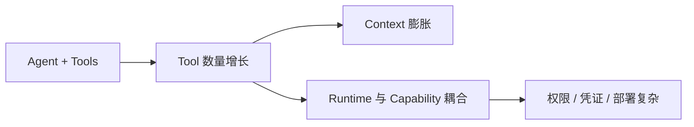
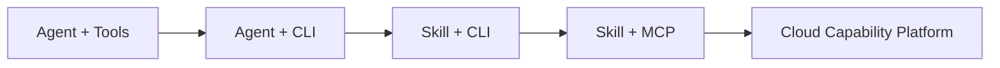
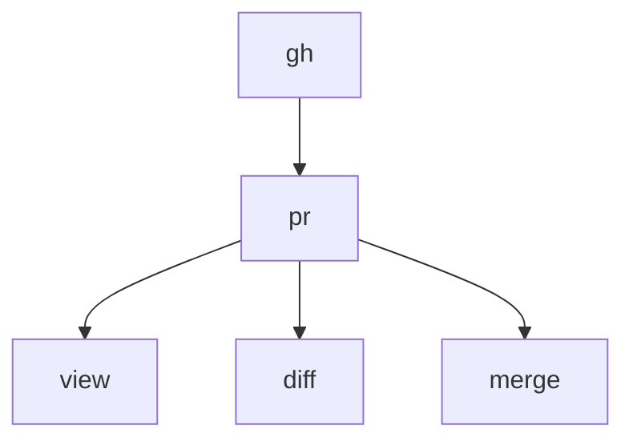
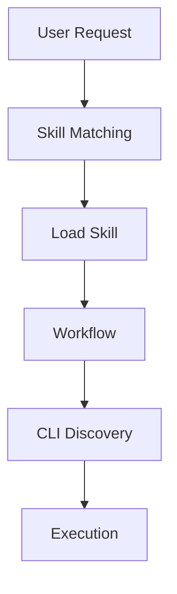
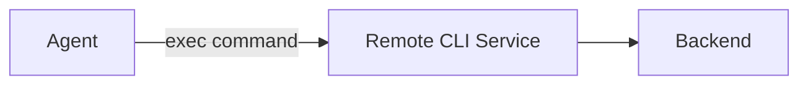
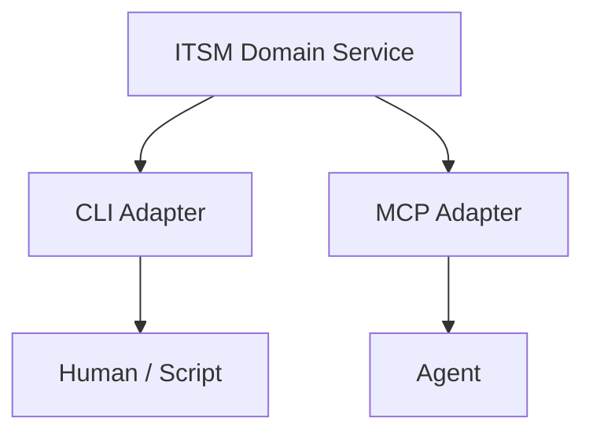
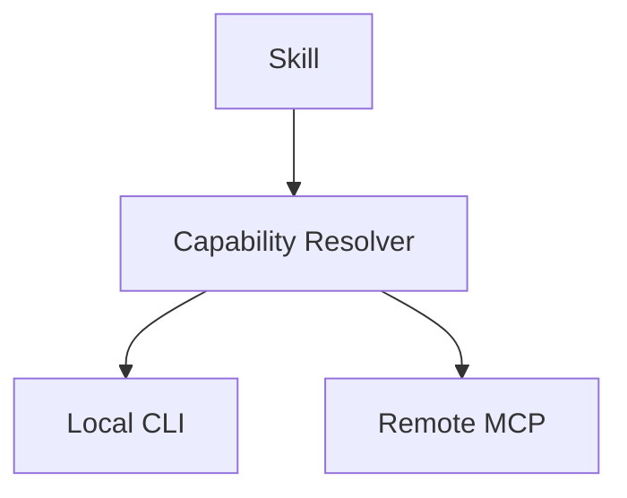
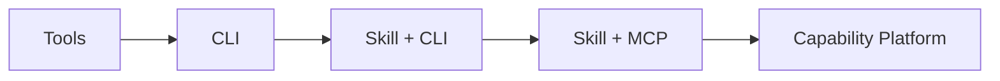

# 从 Skill + CLI 到 Skill + MCP：Agent Harness 的云化演进

最近在设计 Agent Runtime 时，我越来越关注一个问题：

> **当 Agent 的能力越来越多以后，这些能力到底应该放在哪里？**

最简单的 Agent 往往是：

```text
Agent
 ├── Tool A
 ├── Tool B
 ├── Tool C
 └── Tool D
```

工具少的时候，这个设计没有任何问题。

但当 Agent 开始接入 GitHub、ITSM、CMDB、数据库、云平台、内部服务之后，Tool 数量很容易从十几个增长到几百甚至几千个。

这时候问题就出现了。



这也是为什么我认为 Agent Harness 接下来一个很重要的演进方向，是：



这条路线背后，本质上是在解决同一个问题：

> **如何让 Agent 按需理解知识、按需发现能力，并最终让 Capability 与 Agent Runtime 解耦。**

---

# 1. Agent 能力越来越多以后，会遇到什么问题？

## 1.1 Tool Schema 开始占据大量上下文

传统 Tool Calling 通常会把 Tool 的：

```text
name
description
input schema
```

一起提供给模型。

如果只有 10 个 Tool，没有问题。

但假设未来企业 Agent 接入：

```text
GitHub      50 tools
ITSM        80 tools
CMDB        30 tools
Jira        50 tools
Cloud       100 tools
Database    30 tools
...
```

那么 Agent 每次启动都可能需要理解数百个 Tool Schema。

但一次具体任务真正会用到的，往往只有几个。

这实际上形成了一个很奇怪的关系：

```text
Capability Space ≈ Context Space
```

Agent 拥有多少能力，就要把多少能力描述塞进 Context。

这显然不是一个很好的扩展模型。

---

## 1.2 Runtime 开始被各种能力拖重

另外一个问题来自执行环境。

假设我们没有使用 Tool API，而是开始给 Agent 使用 CLI：

```text
Agent Runtime
 ├── git
 ├── gh
 ├── kubectl
 ├── terraform
 ├── aws
 ├── itsm-cli
 ├── cmdb-cli
 ├── python
 └── node
```

看起来 Agent 能力非常强。

但随着能力越来越多：

```text
Agent Runtime = Agent Runtime + Capability Runtime
```

两者逐渐绑在了一起。

增加一个 Capability，可能意味着：

```text
安装 CLI
   ↓
安装依赖
   ↓
配置 Credential
   ↓
修改镜像
   ↓
重新部署 Runtime
```

对于一个 Coding Agent，这可能还能接受。

但如果未来运行 100 个 Agent、1000 个 Agent，这种模式的运维成本会快速放大。

---

## 1.3 Credential 和权限开始失控

还有一个更加现实的问题：

```text
Agent Container
 ├── GitHub Token
 ├── AWS Credential
 ├── DB Password
 ├── Jira Token
 └── ITSM Token
```

Agent 接入的系统越多，Agent Runtime 内部持有的 Secret 就越多。

与此同时，还需要回答：

```text
谁可以调用这个 Tool？
哪个 Agent 可以调用？
哪个 Tenant 可以调用？
是否允许写操作？
是否需要人工审批？
调用结果如何审计？
```

这时候问题已经不再只是：

> 怎么给 Agent 增加一个 Tool？

而变成：

> **如何管理整个 Agent Capability。**

---

## 1.4 Tool 能告诉 Agent"能做什么"，却不一定告诉它"应该怎么做"

例如：

```text
get_change
search_incident
get_ci
approve_change
```

这些 Tool 可以告诉 Agent：

> 我有哪些能力。

但如果让 Agent：

> 帮我评估这个 ITSM Change 是否存在风险。

真正需要执行的 Workflow 可能是：

```text
获取 Change
    ↓
获取关联 CI
    ↓
分析上下游依赖
    ↓
查询历史 Incident
    ↓
查询相似失败 Change
    ↓
检查回滚方案
    ↓
综合风险判断
```

这些流程并不适合全部硬编码进 Tool。

也不应该完全依赖模型每次临场发挥。

于是，Skill 开始变得重要。

---

# 2. Skill + CLI：把 Know-how 和 Capability 分开

CLI 本身其实非常适合 Agent。

例如：

```bash
gh --help
gh pr --help
gh pr view 123
```

Agent 不需要一开始知道 `gh` 的所有命令。

而是可以逐层探索：



这是一种天然的：

> **Progressive Disclosure**

Agent 可以：

```text
不知道能力
   ↓
--help
   ↓
发现能力
   ↓
继续查看子命令
   ↓
真正执行
```

但 CLI 只解决：

> **能做什么。**

Skill 则负责：

> **什么时候做，以及怎么做。**

所以我越来越喜欢下面这个定义：

```text
Skill = Know How
CLI   = Know How to Act
```

进一步可以拆成：

```text
Skill description  = When
Skill instructions = How
CLI                = With What
```

比如一个 ITSM Change Review Skill：

```text
当用户要求评估 Change 风险时：

1. 获取 Change
2. 查询关联 CI
3. 查询历史 Incident
4. 查询相似失败 Change
5. 检查回滚方案
6. 综合评估风险

未经用户明确授权，不执行 approve。
```

真正执行的时候再使用：

```bash
itsm change get
itsm incident search
cmdb ci get
```

整个过程变成：



这里实际上同时存在两层 Progressive Disclosure。

知识层：

```text
Skill Metadata
      ↓
SKILL.md
      ↓
References
```

能力层：

```text
CLI
 ↓
--help
 ↓
Subcommand
 ↓
Arguments
 ↓
Execution
```

这也是 Skill + CLI 很有吸引力的原因：

> **知识按需加载，能力按需发现。**

---

# 3. Skill + CLI 很好，但它仍然是 Local-first

Skill + CLI 对 Coding Agent 非常自然。

因为 Coding Agent 本身就运行在一个 Workspace 中，并且天然需要：

```text
filesystem
shell
git
python
node
```

但如果我们进一步构建的是：

> **Cloud Agent Runtime**

问题就出现了。

假设每一个 Agent Runtime 都需要安装：

```text
gh
kubectl
aws
terraform
itsm-cli
cmdb-cli
...
```

意味着 Capability 与 Agent Runtime 仍然绑定。

不同 Agent 还需要重复配置：

```text
Dependency
Credential
Version
Environment
```

所以真正的 Cloud Agent 不应该只是：

> 把 Agent 搬到云上

而应该进一步思考：

> **Capability 是否也应该从 Agent Runtime 中剥离？**

一种最简单的方法是 Remote CLI：



例如：

```text
exec("itsm change get CHG123")
```

但我认为这种方式并不理想。

因为它只是：

```text
Local Shell → Remote Shell
```

Agent 仍然在拼接字符串，同时失去了很多结构化能力：

```text
Schema
参数校验
Capability Discovery
权限边界
审计
Policy
```

所以真正应该云化的不是：

> **CLI。**

而应该是：

> **CLI 背后的 Capability。**

---

# 4. 从 CLI 到 MCP：真正云化的是 Capability

假设 ITSM 本身提供：

```text
search_change
get_change
update_change
approve_change
```

理想情况下，这些能力首先应该属于一个独立的 Domain Service。

然后针对不同消费者提供不同 Adapter：



人类依然可以：

```bash
itsm change get CHG123
```

Agent 则可以：

```text
itsm.get_change(change_id="CHG123")
```

所以我更倾向于：

```text
CLI = Human-native Interface
MCP = Agent-native Interface
```

它们不一定谁替代谁。

而应该是同一个 Capability 的两种 Adapter。

这样原来的：

```text
Agent
 ↓
Skill
 ↓
CLI
```

就可以自然演进成：

```text
Agent
 ↓
Skill
 ↓
MCP
 ↓
Remote Capability
```

而 Skill 本身的变化其实很小。

如果 Skill 一开始写的是：

```text
1. 获取 Change
2. 查询关联 CI
3. 查询历史 Incident
4. 评估风险
```

它并不关心下面究竟是 CLI 还是 MCP。

真正变化的只是：

```text
Capability Binding
```

例如：

```text
get change

Local: itsm change get
Cloud: itsm.get_change
```

因此 Skill 最好描述：

```text
Intent + Workflow + Rules
```

而不是把执行实现写死。

未来甚至可以：



这意味着 Skill 有机会成为一个与 Runtime 相对解耦的 Workflow 描述。

---

# 5. 最终可能不是 MCP Gateway，而是 Capability Platform

一旦 Capability 被 MCP 化，最大的变化其实不是协议统一。

而是：

```text
Agent Runtime ≠ Capability Runtime
```

Agent Runtime 可以越来越轻：

```text
Cloud Agent Runtime
 ├── Model
 ├── Agent Loop
 ├── Context
 ├── State
 ├── Skill Loader
 ├── MCP Client
 └── Workspace
```

而业务能力独立运行：

```text
GitHub MCP
ITSM MCP
CMDB MCP
Jira MCP
Database MCP
Cloud Platform MCP
```

在它们前面再加上一层 Gateway 统一处理：

```text
Authentication
Authorization
Policy
Audit
Rate Limit
Routing
```

这时整个系统演进成的就不仅仅是一个 MCP Gateway。

而是一个：

> **Cloud Agent Capability Platform。**

当然，这并不意味着所有能力都应该 MCP 化。

像：

```text
filesystem
workspace
shell
python
artifact
```

这些与 Agent Runtime 本身高度相关的能力，保留 Native Tool 会更加自然。

而：

```text
GitHub
ITSM
CMDB
Jira
Database
Cloud Platform
```

这些外部业务 Capability，则非常适合 MCP 化。

所以最终更合理的原则应该是：

> **Runtime 基础能力 Native，外部业务能力 MCP 化。**

---

# 结语

回过头看，这条演进路径可以浓缩成：



最开始我们解决的问题只是：

> Agent 怎么调用 Tool？

随后变成：

> Agent 如何按需发现能力？

Skill 出现以后，又进一步变成：

> Agent 如何知道什么时候、按照什么 Workflow 去组合这些能力？

而到了 Cloud Agent Runtime，真正的问题已经变成：

> **如何把整个企业的 Capability 做成 Agent 可以发现、复用、调用和治理的基础设施？**

所以从 `Skill + CLI` 到 `Skill + MCP`，表面上看只是执行方式从本地 CLI 变成了远程 MCP。

实际上发生的是一次更大的架构变化：

> **Capability 正在从 Agent Runtime 的内部实现，逐渐演进成独立的云端基础设施。**

最终：

```text
Skill defines behavior.
MCP exposes capability.
Gateway governs capability.
Service executes capability.
Harness runs the Agent.
```

即：

> **Skill 定义 Agent 怎么做，MCP 暴露 Agent 能做什么，Gateway 治理这些能力，Service 真正执行，而 Harness 负责让整个 Agent Loop 运转起来。**

这可能才是从本地 Agent Harness 走向 Cloud Agent Runtime 时，最值得关注的一次能力架构演进。
