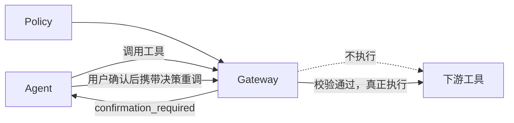
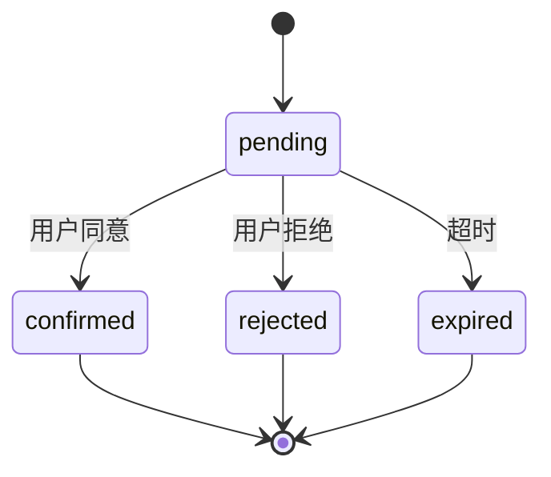
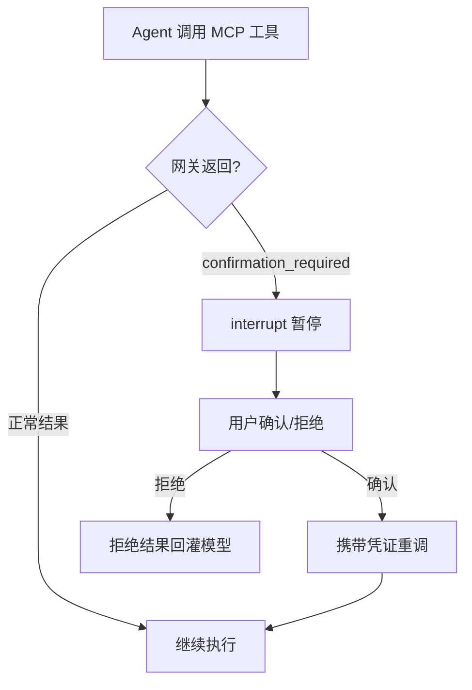
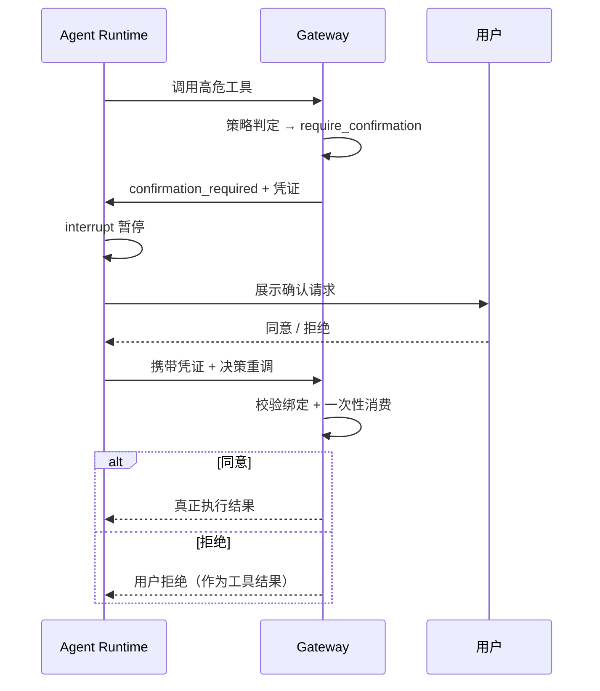

# MCP 网关下的统一 HITL：把人工确认变成平台能力

当 Agent 的能力越来越多、危险操作越来越多之后，一个绕不开的问题是：

> **哪些操作必须经过人确认，确认这件事应该在哪里发生？**

最直觉的做法是在 Agent Runtime 里做：

```text
Agent
 ├── Model
 ├── Agent Loop
 ├── Tools
 └── HITL（工具执行前弹确认）
```

单个 Agent 这样做没有任何问题。

但当能力全部经过 MCP Gateway 暴露、平台上跑着多种 Runtime、多个 Agent 时，问题就出现了。

---

# 1. HITL 散落在 Runtime 里，会遇到什么问题？

## 1.1 每个 Runtime 都要重新实现一遍

不同的 Agent 框架各有各的中断机制。

LangGraph 有 interrupt，别的工作流引擎有自己的暂停/恢复，自研 Loop 又得自己造一套。

结果是：

```text
LangGraph Agent  → 自己的 HITL 实现
DeerFlow Agent   → 自己的 HITL 实现
自研 Agent       → 自己的 HITL 实现
```

每接入一种 Runtime，HITL 就要适配一次。

而用户在界面上看到的确认体验，却应该是一致的。

## 1.2 策略和执行分离，尺度不一致

哪些操作需要确认，这是一个**治理问题**，不是一个**交互问题**。

删除仓库、审批工单、修改线上配置，这些规则应该由平台统一决定。

但如果 HITL 做在 Runtime 里，等于把治理规则交给了每一个 Agent 自己实现：

```text
Agent A 认为删除需要确认
Agent B 认为不需要
Agent C 忘了实现
```

同一个能力，不同入口的确认尺度不一致，这在企业场景里是不可接受的。

## 1.3 Runtime 可以绕过确认

更致命的是：Runtime 自己实现的确认，Runtime 自己也能绕过。

尤其是当 Agent 拿到的是工具的完整调用能力时，"先问一下用户"只是一段可以不执行的代码。

真正的管控必须发生在**能力的必经之路上**。

而 MCP Gateway 正是这条路。

---

# 2. 把 HITL 下沉到网关：确认即拦截

核心思路一句话：

> **网关发现这次调用命中了"需要确认"的策略，就不执行下游工具，而是返回一个结构化的确认请求。**



这个设计里有三个关键选择：

**第一，策略在网关判定。**

哪些工具、哪些参数组合、哪个租户需要确认，全部是网关的策略配置：

```text
allow
deny
require_confirmation
```

判定结果对 Agent 只体现为"这次调用被拦下来了"，Agent 不参与规则。

**第二，拦截时绝不执行。**

命中确认策略的调用，网关不会"先执行再补充确认"，而是直接不执行，把一个结构化的确认请求返回给调用方：

```text
success     = false
error_code  = confirmation_required
confirmation_id
tool / arguments / 提示信息
```

对 Agent 来说，这次工具调用失败了，失败原因很明确：需要人来确认。

**第三，确认请求是一次性凭证。**

网关返回的不是"请重试"，而是一个带有效期的 confirmation。

用户确认后，Agent 携带这个 confirmation 重新发起调用，网关校验通过才真正执行。

---

# 3. Confirmation 应该设计成什么形态？

确认请求的本质是一张**一次性授权凭证**，所以它要像凭证一样设计。

## 3.1 绑定上下文

confirmation 发出来的那一刻，就把"谁、在哪个租户、用哪个凭证、对哪个工具、带什么参数"全部绑定死：

```text
绑定维度
 ├── 用户 / 租户
 ├── 调用凭证
 ├── 目标工具
 └── 参数指纹
```

确认后的重调必须逐项匹配。

这堵住了两类攻击：别人拿到 confirmation_id 也无法替你确认，确认后的调用也不允许偷偷换参数。

## 3.2 一次性消费

confirmation 有状态机：



从 pending 到终态只能发生一次，并发场景下靠原子流转保证——两个请求同时消费同一个 confirmation，只有一个成功。

## 3.3 拒绝也是结果

用户拒绝后，不是抛异常、不是静默失败，而是把"用户已拒绝"作为一个正常的工具结果还给 Agent。

Agent 可以据此调整计划：换个方案、缩小范围、或者向用户解释。

确认交互是 Agent 工作流的一部分，不是它的故障。

---

# 4. Runtime 侧只剩一件事：翻译

HITL 的权威状态在网关，但**暂停和恢复**依然是 Runtime 的能力——Agent Loop 跑在 Runtime 里，只有它能停在那里等用户。

所以 Runtime 侧适配层只需要做翻译：

```text
网关语义                    Runtime 语义
─────────────────────────────────────────
confirmation_required  →   暂停执行，等人工输入
携带决策重调            →   恢复执行
用户拒绝               →   作为工具结果回灌模型
```



这个翻译层做好之后是通用的：

- 换一种 Runtime，只需要换一个翻译层
- 网关的策略、凭证、审计、状态机全部复用
- Agent 与 Skill 对 HITL 无感知，它们只看到"工具返回了需要确认"

这里有一个容易忽略的细节：确认凭证的注入参数不应该暴露给模型。

凭证由翻译层在恢复执行时自动携带，模型的工具描述里不应该出现"你可以自己填 confirmation_id"这种入口——否则等于把授权交还给了模型。

---

# 5. 统一 HITL 的全景

把前面的内容合起来，一次完整的确认流程是：



各层职责清晰分离：

```text
Gateway   拥有 HITL 状态机：策略判定、凭证发放、校验消费、审计
Runtime   只拥有执行暂停权：interrupt / resume
Skill     完全无感知
```

这其实回到了 Capability Platform 的分工：

> **治理属于网关，执行属于 Runtime，而 Skill 只描述意图。**

HITL 不再是某个 Agent 的交互功能，而是平台对所有高危能力的统一治理动作——无论能力被哪种 Agent、以哪种方式调用，确认的规则、凭证和审计都是同一套。

---

# 结语

HITL 表面上看是一个"执行前弹个确认"的交互问题。

但在多 Runtime、多 Agent、能力网关化的架构下，它的正确位置发生了变化：

- 做在 Runtime 里，它是**每个 Agent 的可选行为**，体验不一致、策略可绕过
- 做在 Gateway 里，它是**所有能力的统一治理点**，规则一致、凭证可审计、Runtime 无法绕过

最终的状态可以浓缩成三句话：

```text
策略在网关判定。
凭证在网关消费。
暂停在 Runtime 发生。
```

这也是 Capability 从 Agent Runtime 中解耦之后自然的结果——

> **当能力被统一治理，围绕能力的确认、审计和授权，也自然会沉淀成平台基础设施的一部分。**
