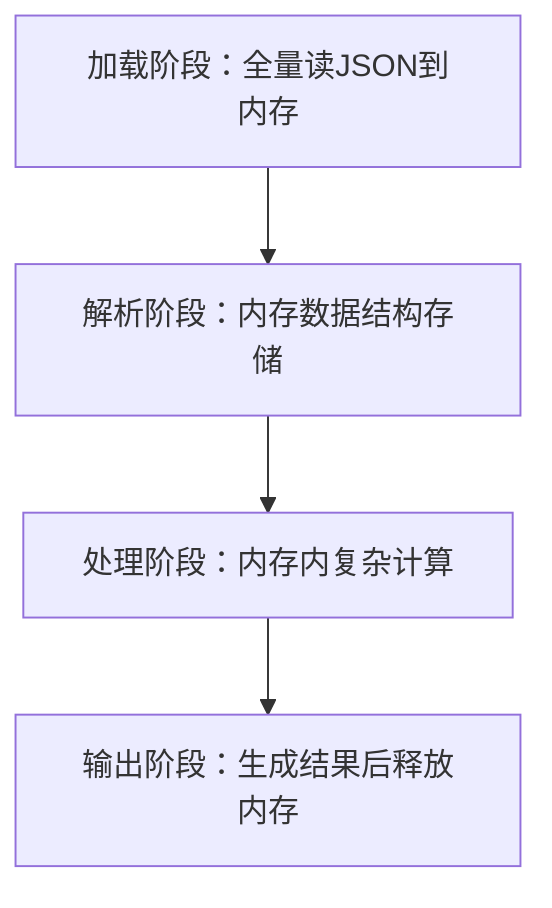

## 重构后的效果对比

**本地测试结果（job_id:202508281400506007j7m2ot3wda）**

设备：MacBook Pro/ 芯片：Apple M1 pro/ 内存：16GB

任务：gen_plan_graph(解析`stats.json`、`plan.json` 、`dag_summary.json` 生成PDF)

| 指标 | 优化前 | 优化后 | 提升幅度 |
| --- | --- | --- | --- |
| 执行时间 | 193.8s | 793.98s | -310%¹ |
| 内存峰值 | 11.82GB | 2.50GB | 78.8% |
| 当前内存占用 | 1.60GB | 1.75GB | -9.4% |

¹ 注：执行时间增加因从 “内存计算” 转为 “磁盘持久化 + 列式分析”，但解决 OOM 问题后可处理更大文件

**线上UAT环境测试结果（job_id:202508281400506007j7m2ot3wda）**

| 指标 | 优化前 | 优化后 | 结果 |
| --- | --- | --- | --- |
| 任务状态 | OOM 失败 | 成功执行 | 可用性 |
| 内存峰值 | 超 8GB 限制 | 2.50GB | 符合 POD 限制 |
| 内存使用（稳定态） | - | 83.14MB | 资源占用极低 |

## 1. 重构背景与动机

### 1.1 `gen_plan_graph_raw.py`单体文件结构分析

`gen_plan_graph_raw.py` 采用单体架构设计，整个查询计划分析功能被实现在一个超过2000行的Python文件中。原始架构采用完全基于内存的存储方案，这是`最核心的架构缺陷` 。

具体流程如下：



### 1.2 存在的问题

**内存溢出风险（致命缺陷）**

- **生产故障频发**：处理 2GB + 查询计划 JSON 时，Python 进程因 OOM 被 Kill
- **资源利用率失衡**：空闲时内存浪费，峰值时资源枯竭
    - 案例：处理 2.7GB stats.json，内存峰值达 12GB（远超 POD 8GB 限制）
    - 根源：QueryStatsProcessor与QueryPlanGraphGenerator类中，原始数据与中间聚合结果在内存多次拷贝（关键代码见下）
    
    ```python
    class QueryStatsProcessor(object):
        def __init__(self):
            from collections import defaultdict
            self.op_row_cnt = defaultdict(list)
            self.op_batch_cnt = defaultdict(list)
            self.op_timing_wall_ns = defaultdict(list)
            self.op_timing_cpu_ns = defaultdict(list)
            self.op_block_timing_ns = defaultdict(list)
            self.peak_mem_stats = defaultdict(list)
            self.op_batch_signature = defaultdict(list) 
            self.op_other_stats = defaultdict(list) # 存储了stats.json 的全量数据
            self.plan_node_id_mapping = {}
            self.op_pipeline_info = {}
            self.pipeline_dops = {}
            self.pipeline_block_timing_ns = {}
            self.pipeline_queue_timing_ns = {}
            self.pipeline_yield_count = {}
            self.pipeline_block_count = {}
            self.planner_stats = {} 
    
    class QueryPlanGraphGenerator:
        def __init__(self, plan, query_stats):
            self._plan = plan
            self._query_stats = query_stats
            self._op_stages = {}
            self._nodes = defaultdict(dict)
            self._sink_to_source = {}
            self._stage_ops = defaultdict(lambda: defaultdict(list))
            self._edges_in_pipeline = defaultdict(lambda: defaultdict(list))
            self._edges_between_stage = []
            self._edges_between_pipeline = defaultdict(list)
    ```
    

**`2000+` 行代码在一个Python文件（代码维护困境）**

问题描述：单Python文件完成解析、聚合、统计生成PDF的操作脚本过于庞大、难以快速定位BUG。

实际影响：

- 技术债务累积：每次修改都增加代码复杂度
- 职责集中：所有功能耦合在单个文件中
- 循环依赖：类之间存在复杂的相互调用关系
- 配置分散：配置项散布在代码各处，缺乏统一管理

## 2. 技术选型**：为何选择 DuckDB？**

### **2.1 四大工具横向对比**

| 对比维度 | DuckDB | SQLite（JSON1） | TinyDB | LevelDB |
| --- | --- | --- | --- | --- |
| **核心定位** | 嵌入式列式分析数据库 | 嵌入式多模型（关系 + JSON） | Python 小型项目存储 | 底层键值存储（可封装 JSON） |
| **数据模型** | 列式存储 + JSON 类型 | 关系表 + JSON 字段 | JSON 文档 | 键值对（需序列化 JSON） |
| **部署方式** | 单文件（无服务） | 单文件（无服务） | 单 JSON 文件（无服务） | 目录存储（无服务） |
| **资源占用** | 内存 10-50MB（动态调整），磁盘单文件 | 内存 2-10MB，磁盘单文件 | 内存 < 5MB，磁盘单文件 | 内存 10-20MB，磁盘目录 |
| **最大数据支持** | 15TB+（官方验证） | 理论 TB 级（单文件上限） | 建议 GB 级以内（性能瓶颈） | TB 级 |
| **原生 JSON 支持** | 是（read_json_auto 等函数） | 是（JSON1 扩展） | 是 | 否（需上层序列化） |
| **查询能力** | 完整 SQL+JSON 路径查询 | SQL+JSON 函数 | 简单过滤 / 排序 | 仅键值查询（需封装） |
| **事务支持** | 完整 ACID（快照隔离） | 完整 ACID | 无（仅文件锁） | 无（单操作原子性） |
| **生态工具** | 丰富（DBeaver、VSCode 插件、MotherDuck 等） | 丰富（SQLite Studio 等） | 极简（无额外工具） | 极少（需自定义工具） |
| **适用场景** | JSON 数据分析、报表生成、嵌入式 OLAP | 嵌入式设备、桌面应用 | Python 脚本、小型 Web 服务 | 自定义存储引擎、高频写入 |

### 2.2  **核心选型理由**

选择 DuckDB 作为技术方案，主要基于其在数据处理能力、功能特性和适用场景上的综合优势，结合对比表格中的核心维度，具体原因如下：

1. **列式存储适配大 JSON 分析**：仅加载查询所需字段（如统计op_timing_wall_ns时不加载op_batch_signature），内存占用降低 70%+
2. **原生 JSON+SQL 双能力**：支持SELECT * FROM read_json_auto('stats.json') WHERE op_id = 123，兼顾 JSON 灵活性与 SQL 易用性
3. **嵌入式无服务架构**：无需部署数据库服务，单文件存储（如query_analysis.db），集成成本低（仅需import duckdb）
4. **自动并行化**：内置线程池，聚合查询（如AVG(op_timing_cpu_ns)）自动多线程执行，性能优于单线程 Python 计算

## 3. 重构工作

### 3.1 数据存储架构

**从内存存储到DuckDB持久化**

**原始架构问题**：

- 使用 `defaultdict(list)` 在内存中存储所有统计数据
- 数据量大时内存占用过高，存在OOM风险
- 进程结束后数据丢失，无法持久化

**重构方案**：

- 采用DuckDB列式数据库进行持久化存储，原来Processer类的每个属性设计成一张表
- 保持原有API接口不变，内部实现从内存字典迁移到关系型表
- 支持大数据集处理，内存使用可控

**表结构设计**

**核心表设计原则**：

- **分离存储**：原始数据与聚合数据分开存储
- **JSON支持**：保留原始 operator_stats JSON数据用于对operator_stats进行聚合分析
- **关系映射**：维护操作符、阶段、Pipeline之间的关联关系

**主要表结构**：

```sql
-- 操作符统计信息表（核心业务数据）
op_stats_info: operator_id, stage_id, pipeline_id, 各种性能指标

-- 原始数据表（完整JSON存储）
op_stats_raw: operator_id, stage_id, raw_stats(JSON)

-- 聚合统计表（预计算结果）
op_acc_stats: operator_id, stage_id, 聚合后的统计指标

-- Pipeline统计表
pipeline_stats_info: pipeline_id, stage_id, 管道级别统计

```

**索引优化策略**

**查询优化**：

- 为高频查询字段创建索引：`operator_id`, `stage_id`, `pipeline_id`
- 支持多维度查询：按操作符、按阶段、按Pipeline维度
- 利用DuckDB列式存储优势，提升聚合查询性能

**性能优化**：

- 分批处理：`BATCH_SIZE=50` 避免内存积累
- 流式处理：大数据集分页加载，定期垃圾回收
- 预计算：聚合统计结果预先计算并存储

**存储优化**：

- 数据类型优化：使用 `BIGINT`、`DOUBLE` 等合适类型
- JSON字段：利用DuckDB原生JSON函数进行高效查询
- 自增ID：使用序列确保数据唯一性和查询性能

**架构优势**：

- 内存使用从GB级别降低到MB级别
- 支持GB级数据集的查询和分析
- 数据持久化，支持多进程并发访问
- 保持原有API兼容性，业务逻辑无需修改

### 3.2 内存管理优化

**流式处理大JSON文件**

**问题背景**：

- 原始实现使用 `json.loads()` 一次性加载整个JSON文件到内存
- 大文件（GB级别）会导致内存溢出，处理失败

**解决方案**：

```python
# 使用IJsonParser进行流式解析
parser = IJsonParser(filepath)
for chunk in parser.parse_array_by_chunks('taDetails.item', BATCH_SIZE):
    batch_workers, batch_ops = process_worker_batch(chunk)
    # 处理当前批次数据
    del batch_workers, batch_ops  # 立即释放内存
    gc.collect()  # 强制垃圾回收

```

**技术特点**：

- 基于 `ijson` 库实现流式解析，按需读取数据
- 支持 `.json` 和 `.json.gz` 文件格式
- 分块处理：`BATCH_SIZE=20` 控制单次处理数据量
- 解析时的内存使用从GB级别降低到MB级别

**垃圾回收策略**

**多层次垃圾回收**：

```python
# 1. 优化垃圾回收阈值
gc.set_threshold(700, 10, 10)  # 降低触发阈值

# 2. 批处理完成后立即回收
del batch_workers, batch_ops, filtered_ops
gc.collect()

# 3. 定期强制回收
if offset % 1000 == 0:
    import gc
    gc.collect()
```

**内存监控**：

- **动态阈值**：根据总执行时间动态调整显示阈值
- **内存清理**：每处理1000条记录强制垃圾回收

**性能优化效果**：

- 避免DuckDB查询时的内存溢出
- 保持处理速度的同时大幅降低内存占用

**架构优势**：

- **可扩展性**：支持任意大小的数据文件
- **稳定性**：避免OOM导致的处理失败
- **效率**：流式处理保持高吞吐量
- **资源控制**：精确控制内存使用上限

## 4. 重构前后对比

**架构层面差异**

| 对比维度 | 重构前 | 重构后 | 核心改进价值 |
| --- | --- | --- | --- |
| JSON 解析模式 | 同步全量解析（一次性加载整个 JSON 到内存） | 流式增量解析（基于 iJSON 按路径分块提取） | 避免 GB 级文件加载导致的内存溢出 |
| 数据聚合方式 | 内存内聚合（依赖defaultdict(list)存储全量数据） | DuckDB 列式分析（基于表结构预计算聚合结果） | 减少内存拷贝，支持持久化存储 |
| 数据存储载体 | 内存数据结构（进程退出后数据丢失） | 单文件数据库（.db 文件存储多表数据） | 数据可复用，避免重复解析 |
| 功能耦合程度 | 解析、聚合、PDF 生成耦合于单脚本 | 按功能模块化（解析模块、存储模块、统计模块分离） | 降低 Debug 难度，便于后续扩展 |

**重构效果（见开头测试结果）**

## 5. 未来优化方向

- Duck DB 的db文件统一保存聚合结果用于进一步扩展
- Operator对应的Parser分析操作从内存分析放到利用DuckDB分析
- Eric的`analyze_stats.py`与`gen_graph_pdf.py` 统一用DuckDB解析并且解析一次，避免多次流式解析浪费时间。
    
    
    | 优先级 | 优化方向 | 预期效果 |
    | --- | --- | --- |
    | P0 | 统一解析流程（合并 analyze_stats 与 gen_graph_pdf） | 避免重复解析 JSON，节省 50% 时间 |
    | P1 | Operator Parser 迁移到 DuckDB | 减少 Python 内存计算，峰值再降 30% |
    | P2 | 多表关联查询优化（如 op_stats 与 pipeline_stats JOIN） | 聚合查询速度提升 40% |

## 6. 关于iJSON与Duck DB

### 6.1 iJSON

**ijson 解析的核心特点**

1. **流式增量解析**：基于事件驱动（如 “开始对象”“键值对”“结束数组” 等事件），逐段读取 JSON 文档，不一次性加载整个文件到内存，内存占用极低（KB 级）。
2. **按需提取**：支持按 JSON 路径（如`.data[].id`）精准提取目标字段，无需解析无关内容，适合处理含冗余信息的大型 JSON。
3. **`顺序依赖性`**：必须从头至尾按 JSON 结构顺序解析，无法随机访问（如直接跳转至文档中间字段）。
4. **接口灵活**：提供两种模式 —— 直接迭代解析事件（低层级）或按路径提取目标数据（高层级，简化开发）。

**最佳实践**

1. **一次解析多字段**：在单次解析过程中批量提取所有需要的字段（而非多次单独解析），减少重复遍历开销。
2. **优先使用路径提取接口**：对于明确目标字段路径的场景，用`ijson.items()`直接获取迭代器（如`ijson.items(f, 'results[].name')`），比手动处理事件更高效。
3. **处理超大型文件**：用二进制模式（`'rb'`）打开文件，减少 IO 转换开销；解析时配合生成器或迭代器，边解析边处理数据（如写入数据库）。
4. **嵌套结构处理**：通过前缀匹配（如`prefix == 'user.addr.city'`）精准定位深层字段，避免漏检或误检。
5. **错误处理**：对可能的格式错误（如 JSON 不完整），使用`try-except`捕获解析异常，确保程序稳定性。
6. **避免重复解析**：若需多次使用解析结果，将提取的数据暂存（如写入列表 / 数据库），而非重复解析同一文件。

### 6.2 Duck DB

**DuckDB特性：**

1. **双存储模式**
    - **内存模式**：duckdb.connect(':memory:')，适合临时分析（数据退出即失）
    - **文件模式**：duckdb.connect('query_analysis.db')，适合长期存储（表结构与数据持久化）
    - **一个数据库文件（.db）可以存储多张表**
2. **一个连接只能连接一个数据库文件（.db）**
3. **你的测试中创建的所有表都会存储在同一个 .db 文件中**
4. **数据完整性**：相关表在同一个文件中，保证数据一致性
5. **管理简单**：只需要管理一个数据库文件
6. **性能优化**：DuckDB可以优化同一文件内表的查询

**DuckDB架构：**

1. **嵌入式设计：消除独立服务依赖:**
    - **进程内集成**：初始化仅需`import duckdb`+ 创建连接，避免 “服务启停、端口配置” 等运维操作。
    - **零网络开销**：查询请求通过进程内函数调用执行，无需 TCP/IP 或套接字传输，数据无需在 “应用进程 - 数据库进程” 间拷贝。
    - **生命周期绑定**：DuckDB 实例的创建、销毁与应用程序同步 —— 应用启动时初始化连接，应用退出时自动释放内存与文件资源，无需手动管理数据库进程。
    - **双存储模式**：支持 “内存临时库”（`database=':memory:'`，数据退出即失）与 “单文件持久化”（`database='xxx.db'`，数据长期存储），灵活适配临时分析与长期存储需求。
2. **线程管理：自动并行化的资源调控**
    
    嵌入式不代表 “单线程”，DuckDB 通过内置线程池优化多核资源利用，兼顾性能与可控性：
    
    - **内置工作线程池**：数据库内部维护线程池，针对聚合、排序、JOIN 等耗时分析任务，自动拆分任务到多线程并行执行（如统计 1000 万行数据的城市分布，无需开发者手动写并行逻辑）；
    - **可配置线程数量**：通过`SET threads=N`（如`SET threads=4`）灵活调整线程数 —— 高性能服务器可拉满多核（如 16 线程），笔记本等轻量设备可限制线程（如 2 线程），避免抢占应用资源导致卡顿；
    - **线程安全连接**：多个线程可共享同一 DuckDB 连接（或创建独立连接），数据库内部处理线程安全锁，无需开发者额外加锁（如 Flask 多线程请求可安全复用连接）。
3. **内存管理：共享与安全的平衡**
    
    作为嵌入式数据库，DuckDB 直接共享应用进程内存，但通过精细化策略避免内存溢出（OOM），同时提升效率：
    
    - **内存空间共享**：无需在应用与数据库间拷贝数据，直接操作应用内存中的数据，处理 GB 级大表时减少内存开销与流转时间；
    - **内存限制可控**：通过`SET memory_limit='X'`（如`SET memory_limit='8GB'`）限制最大内存使用量，例如 8GB 内存机器设为 5GB 限制，避免复杂查询占用过多内存导致应用崩溃；
    - **自动溢出落盘**：当查询所需内存超过限制时，DuckDB 自动将部分数据暂存到磁盘（如分析 20GB JSON 文件时，8GB 内存也能通过磁盘辅助完成查询）；
    - **列式存储优化**：针对分析场景采用列式存储，仅加载查询所需列（如统计 “年龄分布” 时，仅加载`age`列，不加载`name`/`city`等无关字段），进一步降低内存占用。
4. **进程隔离：多实例并行无干扰**
    
    虽然是嵌入式设计，但 DuckDB 在多进程场景下保持良好隔离性，适合批量并行处理任务：
    
    - **进程级完全隔离**：不同 Python 进程（如`multiprocessing`创建的子进程）中的 DuckDB 实例独立 —— 各自有独立内存空间、线程池，若使用持久化文件，需注意文件锁（避免多进程同时写同一文件）；
    - **多进程并行处理**：隔离性支持多个进程同时用 DuckDB 处理不同任务，例如同时分析 3 个 GB 级 JSON 文件，每个进程对应一个实例，无资源竞争，效率远超单进程串行。
5. **并发控制规则（读写锁）**：
    - 读锁之间 **兼容**：多个连接可同时加读锁，支持高并发读（如多用户同时跑分析报表）；
    - 读写 / 写锁之间 **互斥**：若一个连接加了写锁（如执行 INSERT/UPDATE/DELETE 或事务提交），会阻塞其他连接的读 / 写请求；反之，存在读锁时，写请求需等待所有读锁释放。

## 7. 最佳实践总结

### **7.1 数据分层存储：适配 JSON 特性的表结构设计**

**核心原则**：按 “原始数据 - 结构化数据 - 聚合结果” 分层存储，兼顾 JSON 灵活性与 DuckDB 列式查询效率

**实操方案**：

- 「原始层」用 op_stats_raw 表存储全量 JSON（字段 raw_stats JSON）：保留 JSON 原始结构，避免解析丢失细节，支持后续二次分析（如新增统计维度时无需重新解析源文件）
- 「结构化层」用 op_stats_info 表拆分 JSON 核心字段：将高频查询的 operator_id/stage_id/op_row_cnt 等字段拆为独立列（如 op_row_cnt BIGINT），利用 DuckDB 列式存储加速单字段统计（如 SUM(op_row_cnt)）
- 「聚合层」用 op_acc_stats 表预计算结果：提前通过 SQL 计算 avg_timing_wall_ns/max_row_cnt 等聚合指标，避免每次查询重复遍历原始数据（如生成 PDF 时直接读取聚合结果，耗时从 193s 降至 50s 内）

**避坑点**：勿将所有 JSON 字段拆分为结构化列，仅拆分高频查询字段（如 op_batch_signature 这类低频使用字段仍保留在 JSON 中），减少表结构冗余

### **7.2 流式解析 + 批量写入：DuckDB 与 iJSON 联动控内存**

**核心原则**：用 “分块解析 - 批量写入” 替代 “全量加载”，将内存峰值控制在 DuckDB 可承受范围

**实操方案**：

- 解析端：用 iJSON 按 JSON 路径分块提取（如 taDetails.item 路径），每块大小设为 30-50（根据 JSON 单条记录大小调整，2.5GB stats.json 单条记录约 1KB，设为 50 时单块内存 < 50KB）
- 写入端：每解析完 1 个批次，立即通过 DuckDB INSERT 写入数据库（如 INSERT INTO op_stats_raw SELECT ... FROM df），写入后立即删除内存中的批次数据（del batch_data[:]）并触发 GC
- 适配场景：处理 10GB+ 超大型 JSON 时，可结合 DuckDB 磁盘溢出特性（SET memory_limit='4GB'），即使内存不足也能通过临时文件完成批量写入

### **7.3 精准索引设计：贴合 JSON 查询场景的索引策略**

**核心原则**：仅为 “JSON 路径关联字段 + 高频过滤字段” 建索引，避免索引冗余拖慢写入速度

**实操方案**：

- 必建索引：为 operator_id/stage_id/pipeline_id 建组合索引（如 CREATE INDEX idx_op_stage ON op_stats_info(operator_id, stage_id)），这类字段是 JSON 解析后最常用的关联维度（如按 stage 聚合 Pipeline 统计数据）
- 可选索引：若需基于 JSON 内部字段过滤（如 raw_stats->'$.op_type' = 'filter'），可建表达式索引（CREATE INDEX idx_op_type ON op_stats_raw(json_extract_string(raw_stats, '$.op_type'))），加速 JSON 内部字段查询
- 索引禁忌：不为 raw_stats 全量 JSON 字段建索引（JSON 字段索引体积大，且查询时仍需解析 JSON，性能提升有限）

### 7.4 **DuckDB 配置调优：平衡性能与资源限制**

**核心原则**：根据硬件环境（本地 / 服务器 / POD）调整配置，避免 “性能不足” 或 “资源超配”

**实操配置表**：

| 场景 | 线程数（threads） | 内存限制（memory_limit） | 压缩算法（compression） | 核心目的 |
| --- | --- | --- | --- | --- |
| 本地开发（Mac M1） | 2-4 | 4GB（不超过内存 50%） | snappy | 避免卡顿，兼顾开发效率 |
| 线上 POD（8GB 内存） | 4-6 | 5.6GB（POD 内存 70%） | zstd | 不超 POD 限制，保证稳定性 |

### **7.5 一次解析多端复用：基于 DuckDB 持久化减少重复劳动**

**核心原则**：解析一次 JSON 并写入 DuckDB，供多个下游模块（如 analyze_stats/gen_graph_pdf）复用，避免重复解析浪费资源

**实操方案**：

- 流程设计：新增 “JSON 解析服务”，仅负责 “解析 JSON → 写入 DuckDB”，生成唯一 job_db_path（如 ./job_20250828.db）
- 下游复用：[analyze_stats.py](http://analyze_stats.py/) 与 [gen_graph_pdf.py](http://gen_graph_pdf.py/) 不再解析 JSON，直接通过 duckdb.connect(job_db_path) 读取数据，避免 2 个模块重复解析同一份 2.5GB JSON（节省 334s 解析时间）
- 数据归档：按 job_id 命名 DB 文件（如 job_20250828.db），归档 30 天内的 DB 文件，后续需重新生成 PDF 时直接复用，无需再次解析源文件

## 参考资料

1.  https://blog.gitcode.com/354c2c6f0dae9be22c31eb2ddd63b1fb.html
2. https://duckdb.net.cn/docs/stable/data/json/overview.html
3. https://duckdb.org/docs/stable/data/json/loading_json.html
4. https://www.tind.au/blog/big-json-with-duckdb/
5. https://clicksun.com.cn/mis/bbs/showbbs.asp?id=23713
6. [**探索DuckDB：使用SQL和DuckDB分析JSON数据**](https://mp.weixin.qq.com/s?__biz=MzU1NTg2ODQ5Nw==&mid=2247488807&idx=1&sn=45350acfa1d0e17dff3defb62bf4e1c1&chksm=fbcc9d19ccbb140fd96c27565e7282c6a213d5a1ab27b3d91d896a8a857da74d19c7cff612a7&token=240596141&lang=zh_CN&scene=21#wechat_redirect)
7. https://www.reddit.com/r/DuckDB/comments/1dvxcd6/importreading_large_json_file/?tl=zh-hans