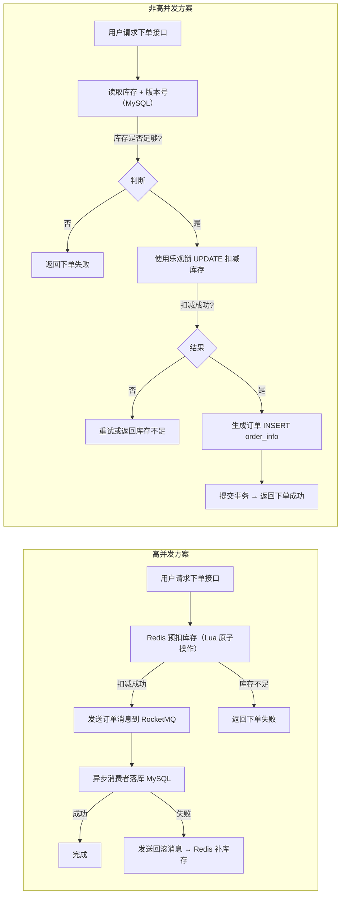

# 【JAVA】【DB】【MQ】库存预扣 + MySQL 最终落库技术方案（Java + Redis + RocketMQ）

<aside>
💡

1. 请求提交订单接口与库存预扣减的关系

在典型的 **Redis 预扣库存 + MySQL 最终落库**架构中：

1. **用户请求提交订单接口（下单接口）**：
    - 是用户触发整个下单流程的入口。
    - 接口会执行 **库存预扣减**，但不是简单写 Redis，而是有完整业务逻辑和幂等处理。
2. **库存预扣减时机**：
    - **在接口内部立即调用 Redis 扣减库存**，保证高并发下库存不被超卖。
    - 如果 Redis 扣减失败（库存不足），直接返回下单失败。
3. **顺序流程**：
    1. 用户请求下单接口
    2. Redis Lua 原子扣减库存
        - 库存不足 → 返回失败
        - 库存充足 → 扣减成功
    3. 生成订单消息 → 发送 RocketMQ
    4. 消费者异步落库 MySQL
        - 成功 → 完成
        - 失败 → 发送回滚消息 → Redis 补库存

---

**2. 设计原则**

- **Redis 扣减库存要在下单接口内立即完成**
    - 确保并发情况下库存安全
    - 接口响应时间快（Redis 原子操作很快）
- **落库是异步的**
    - 不阻塞接口返回
    - 通过 MQ 异步保证最终一致性
- **接口层只负责触发预扣和消息投递**
    - 业务权威存储仍在 MySQL
    - 异常回滚、超时释放库存由消费者/定时任务处理

---

3. 核心结论

✅ **用户下单接口确实是库存预扣减的触发点**

- 下单接口先在 Redis 扣减库存
- 然后异步落库 MySQL
- 回滚、超时释放库存通过**消息队列或定时任务处理**
</aside>

## 1. 背景与场景

在电商秒杀或大促场景中：

- 单品库存有限，高并发请求可能瞬间打爆数据库。
- 订单生成与库存扣减必须保证一致性，否则可能出现 **超卖/少卖**。
- Redis 提供高性能内存操作，是库存预扣的理想选择，但不适合作为权威数据源。

**目标**：

通过 Redis 预扣库存削峰、RocketMQ 异步落库 MySQL，实现 **最终一致性**，同时保证系统可靠、可恢复。

---

## 2. 系统架构

```
┌─────────────┐
│  用户请求   │
└──────┬──────┘
       │
       ▼
┌─────────────┐
│   API 服务   │
│  (Java)     │
└──────┬──────┘
       │
       │  1. Redis 预扣库存 (Lua 原子操作)
       ▼
┌─────────────┐
│    Redis     │
└──────┬──────┘
       │
       │  2. 订单消息发送
       ▼
┌─────────────┐
│ RocketMQ MQ │
└──────┬──────┘
       │
       │  3. 消费者落库
       ▼
┌─────────────┐
│   MySQL      │
│ (库存 & 订单)│
└──────┬──────┘
       │
       │  4. 失败回滚/补偿
       ▼
┌─────────────┐
│    Redis     │
│ (库存修复)  │
└─────────────┘

```

**流程说明**：

1. **Redis 预扣库存**：秒杀/下单请求先在 Redis 扣减库存，通过 Lua 脚本保证原子性。
2. **发送订单消息**：扣减成功后，将订单信息写入 RocketMQ，异步落库。
3. **MySQL 最终落库**：消费者收到消息后，生成订单记录，同时更新 MySQL 中的真实库存。
4. **失败回滚与补偿**：
    - 消费者落库失败 → 发送回滚消息恢复 Redis 库存。
    - 用户未支付超时 → 定时任务扫描 Redis & MySQL，释放库存。

---

## 3. 核心技术要点

### 3.1 Redis 预扣库存

- 使用 Lua 脚本实现“检查库存 → 扣减库存”的原子操作：
    - 避免并发下超卖。
    - 支持多商品批量扣减。
- Redis 中只保留临时库存状态，最终库存权威在 MySQL。

### 3.2 RocketMQ 异步落库

- 订单消息格式包含：
    - 订单号（全局唯一，幂等处理关键）
    - 用户ID、商品ID、数量
    - 时间戳、状态
- 消费者必须幂等：
    - MySQL 订单表建立 **订单号唯一索引**
    - 重复消费消息不会导致重复扣减

### 3.3 MySQL 最终库存与订单存储

- 订单表与库存表分开：
    - 库存表记录真实可用库存
    - 订单表记录订单详情
- 落库顺序：
    1. 生成订单记录
    2. 扣减 MySQL 库存
    3. 更新订单状态（可选：待支付 → 已支付）

### 3.4 异常处理与回滚

- **Redis 回滚**：
    - 消费失败 → 增加库存
    - 用户超时未支付 → TTL 过期或定时任务释放
- **最终一致性对账**：
    - 定时任务比对 Redis 与 MySQL 库存
    - Canal 监听 MySQL binlog 修复 Redis 缓存

---

## 4. 流程时序

```
用户请求下单
   │
   ▼
API 服务
   ├─ Redis Lua 扣减库存
   │     └─ 库存不足 → 返回失败
   │
   └─ 发送订单消息到 RocketMQ
         │
         ▼
消费者服务
   ├─ 落库 MySQL（订单 + 库存扣减）
   │     └─ 成功 → 完成
   │     └─ 失败 → 发送回滚消息到 Redis
         │
         ▼
Redis 库存回滚 / 定时任务释放库存

```

---

## 5. Java + RocketMQ 方案要点（最佳实践）

| 关键点 | 做法 | 原因 |
| --- | --- | --- |
| Redis 扣减库存 | Lua 脚本原子操作 | 避免超卖，保证高并发下正确性 |
| 消息异步落库 | RocketMQ 生产 + 消费 | 解耦业务逻辑，削峰，支持幂等消费 |
| 幂等处理 | 订单号唯一索引 + 消费者幂等逻辑 | 防止重复消息造成多扣库存 |
| 回滚机制 | 消费失败或超时 → Redis `INCR` | 保证 Redis 与 MySQL 最终一致 |
| 数据对账 | Canal + 定时任务 | 修复 Redis 缓存，保证一致性 |
| 超时订单处理 | Redis TTL 或定时任务 | 避免库存被未支付订单占用 |
| 系统监控 | MQ 消息堆积、库存异常告警 | 快速发现异常并处理 |

## 6. 总结

1. **Redis 只做库存预扣减** → 保证高并发下的库存安全。
2. **MySQL 做最终库存与订单权威存储** → 财务和结算依赖。
3. **RocketMQ 异步落库 + 回滚机制** → 保证系统可靠性和最终一致性。
4. **Lua 原子操作 + 幂等消费 + TTL / 对账机制** → 解决常见超卖、丢单、重复扣减问题。

---

✅ **适用场景**：

- 秒杀、抢购、大促活动
- 高频库存扣减
- 需要最终一致性但可容忍短时 Redis 与 MySQL 差异的业务

---

## 7. 非高并发场景下的讨论

---

### 7.1 实现方案

如果不是高并发场景，那么系统对瞬时流量压力要求不高，可以简化 Redis 预扣和异步落库的复杂性，直接以 **MySQL 为权威存储**，减少不必要的中间层。以下是最佳实践思路：

---

1. 核心原则

- **MySQL 直接处理库存与订单**：
    - 在下单接口直接操作 MySQL 库存表和订单表。
    - 保证事务一致性（库存扣减和订单生成在同一个事务内）。
- **Redis 可选作为缓存**：
    - 用于加速订单查询或库存显示，而不是库存预扣。
    - 避免了复杂的回滚、MQ、最终一致性问题。

---

2. 推荐流程

顺序流程：

1. **用户请求下单接口**
    - 接口直接调用 Service 层处理订单。
2. **MySQL 事务处理**
    - 扣减库存（`UPDATE stock SET quantity = quantity - ? WHERE id = ? AND quantity >= ?`）
    - 生成订单记录
    - 同一事务提交，保证 **原子性**。
3. **返回结果**
    - 下单成功或库存不足直接返回
    - 无需异步消息队列
4. **Redis 缓存（可选）**
    - 缓存库存数量或订单状态，用于快速展示
    - 通过定时刷新或落库后更新，保证缓存一致性即可

3. 优势

- 架构简单：没有 MQ、没有 Redis 回滚机制
- 数据强一致：库存和订单在同一 MySQL 事务中，避免超卖/少卖
- 可维护性高：适合中小规模或低并发业务

4. 技术要点

- **事务操作**：
    - 扣库存和生成订单放在同一事务，确保原子性
- **库存判断**：
    - 在 SQL 里加条件 `quantity >= ?` 避免负库存
- **缓存策略**：
    - 可用 Redis 缓存库存/订单，但只作为只读加速，最终权威仍是 MySQL
- **并发量低，不用 Lua 脚本或 MQ**：
    - 因为 MySQL 足够处理流量，架构不复杂
- **监控与告警**：
    - 对库存异常或订单异常进行监控即可，无需复杂补偿逻辑

---

5. 总结

- **非高并发场景最佳实践**：
    - **MySQL 直接扣库存 + 生成订单**
    - **Redis 仅作缓存，可选**
    - **事务保证一致性**
- 优点：
    - 简单可靠，数据强一致
    - 维护成本低，不需要 MQ、回滚机制、异步补偿
- 缺点：
    - 并发量高时容易成为瓶颈，需要再引入 Redis 预扣减 + MQ 异步落库

### 7.2 MySQL 乐观锁库存扣减 + 订单生成

---

**1. 场景概述**

- 适用于 **非高并发或中等并发场景**。
- 用户下单时，需要保证 **库存不被超卖**。
- MySQL 作为权威存储，订单和库存在同一事务内保证一致性。
- 乐观锁通过 **版本号** 实现并发冲突检测。

---

**2. 数据表设计**

库存表（stock）

```sql
CREATE TABLE stock (
    id BIGINT PRIMARY KEY AUTO_INCREMENT,
    product_id BIGINT NOT NULL,
    quantity INT NOT NULL,
    version INT NOT NULL DEFAULT 0,
    updated_at TIMESTAMP DEFAULT CURRENT_TIMESTAMP ON UPDATE CURRENT_TIMESTAMP
);

```

订单表（order_info）

```sql
CREATE TABLE order_info (
    id BIGINT PRIMARY KEY AUTO_INCREMENT,
    order_no VARCHAR(64) UNIQUE NOT NULL,
    user_id BIGINT NOT NULL,
    product_id BIGINT NOT NULL,
    quantity INT NOT NULL,
    status VARCHAR(20) NOT NULL DEFAULT 'PENDING',
    created_at TIMESTAMP DEFAULT CURRENT_TIMESTAMP
);

```

---

**3. 核心流程**

1. **用户请求下单** → 调用下单接口
2. **读取库存及版本号**
    
    ```sql
    SELECT quantity, version
    FROM stock
    WHERE product_id = ${productId};
    ```
    
    `${productId}` → 对应商品 ID 变量
    
3. **判断库存是否足够**
    - 库存不足 → 返回失败
    - 库存足够 → 尝试扣减库存
4. **使用乐观锁更新库存**
    
    ```sql
    UPDATE stock
    SET quantity = quantity - ${purchaseQuantity},
        version = version + 1,
        updated_at = CURRENT_TIMESTAMP
    WHERE product_id = ${productId}
      AND version = ${currentVersion}
      AND quantity >= ${purchaseQuantity};
    ```
    
    - `${purchaseQuantity}` → 本次购买数量
    - `${currentVersion}` → 查询库存时读取的版本号
    - `${productId}` → 商品 ID
    - 返回影响行数 = 1 → 扣减成功
    - 返回影响行数 = 0 → 扣减失败，表示冲突或库存不足
5. **生成订单**
    
    ```sql
    INSERT INTO order_info (order_no, user_id, product_id, quantity, status, created_at)
    VALUES ('${orderNo}', ${userId}, ${productId}, ${purchaseQuantity}, 'PENDING', CURRENT_TIMESTAMP);
    ```
    
    - `${orderNo}` → 全局唯一订单号
    - `${userId}` → 下单用户 ID
    - `${productId}` → 商品 ID
    - `${purchaseQuantity}` → 购买数量
6. **提交事务**
    - 成功 → 返回下单成功
    - 失败 → 回滚库存（可选重试或提示库存不足）

---

**4. 流程时序图**

```
用户请求下单
      │
      ▼
读取库存 + 版本号
      │
      ▼
判断库存是否足够
      │
      ▼
尝试使用乐观锁更新库存
 ┌───────────────┐
 │ 更新成功      │ ──> 生成订单 -> 提交事务 -> 返回成功
 └───────────────┘
 ┌───────────────┐
 │ 更新失败      │ ──> 重试或返回库存不足
 └───────────────┘

```

图示说明

1. 每次扣减库存前，先获取当前版本号。
2. 更新库存时，通过 `WHERE version = ?` 保证只有未被修改的库存才能扣减。
3. 如果更新失败，说明有并发操作发生，可选择重试或直接返回失败。
4. 订单生成在同一事务内，保证库存扣减与订单创建原子性。

**5. 技术要点**

- **幂等处理**
    - 订单号唯一约束，防止重复下单。
- **库存原子性**
    - `quantity >= ?` + `version = ?` 保证不会出现负库存。
- **失败重试策略**
    - 可设置重试次数（如 2~3 次）
    - 避免无限重试占用数据库资源
- **事务管理**
    - 使用数据库事务包裹库存更新 + 订单生成
    - 保证原子性与一致性

**6. 总结**

- 乐观锁适合 **非高并发或中等并发场景**，简单高效。
- Redis / MQ 可省略，架构更简单。
- 核心是 **版本号 + SQL 条件 + 事务**，保证库存与订单一致性。

## 8. 方案对比

| 特性 / 场景 | 高并发场景 | 非高并发场景 |
| --- | --- | --- |
| **核心目标** | 防止超卖、应对瞬时流量 | 保证库存一致性即可，性能压力低 |
| **库存操作方式** | Redis 预扣库存（Lua 原子操作） | MySQL 事务直接扣库存 |
| **订单处理** | 异步落库 MySQL，通过 RocketMQ 消息队列 | 同步落库 MySQL（库存扣减 + 订单生成同一事务） |
| **缓存使用** | Redis 做库存预扣和缓存 | Redis 可选，仅做展示/加速查询 |
| **并发控制** | Redis Lua 原子操作 + 消息队列幂等消费 | MySQL 乐观锁（版本号）即可 |
| **事务与一致性** | MySQL 为权威，Redis 仅削峰；最终一致性通过 MQ + 回滚机制保证 | MySQL 事务保证原子性，一致性强 |
| **回滚机制** | 必须：MQ 异步回滚库存、超时释放库存、定时校验 | 可选：事务失败直接回滚，无需 MQ |
| **架构复杂度** | 高：涉及 Redis、RocketMQ、异步处理、回滚机制 | 低：只涉及 MySQL，事务保证原子性 |
| **适用场景** | 秒杀、大促、限量抢购、高并发抢购场景 | 普通下单、库存量大、并发压力低的场景 |
| **优点** | 高性能、高并发下防超卖、削峰 | 简单可靠、维护成本低、强一致性 |
| **缺点** | 架构复杂、实现成本高、最终一致性容忍短暂不一致 | 并发量大时可能成为瓶颈，不能承受瞬时高流量 |

