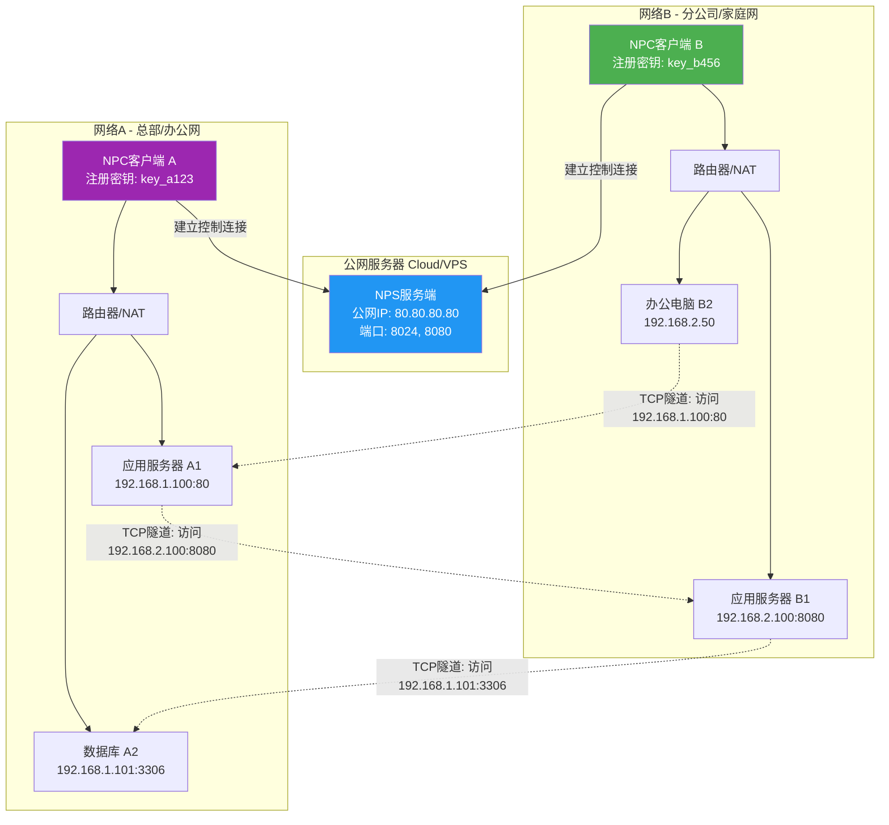
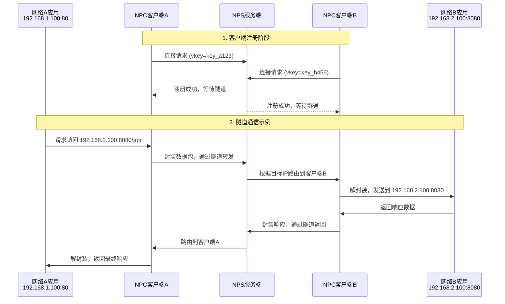
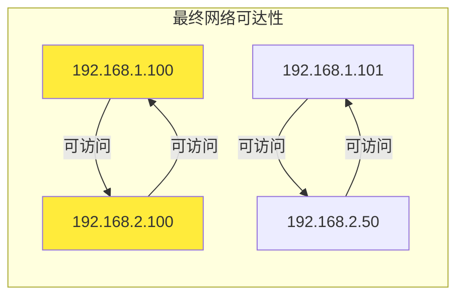

## 详细架构图



### 数据流验证图



### 配置要点确认

**NPS 服务端配置确认:**

```bash
# nps.conf 关键配置
server_addr=0.0.0.0
bridge_port=8024    # 客户端连接端口
web_port=8080       # 管理界面端口

# 客户端认证
[[clients]]
name = network_a
key = key_a123      # 客户端A的密钥

[[clients]]
name = network_b
key = key_b456      # 客户端B的密钥

```

**隧道规则配置:**

- 需要在 NPS 管理界面配置隧道规则
- 定义哪些端口的流量转发到哪个客户端
- 支持 TCP/UDP 端口映射

### 实际连接效果



 这个架构展示了：

1. ✅ 两个隔离内网通过公网NPS建立连接
2. ✅ NPC客户端主动连接NPS服务端
3. ✅ 通过隧道实现双向通信
4. ✅ 支持各种TCP/UDP应用