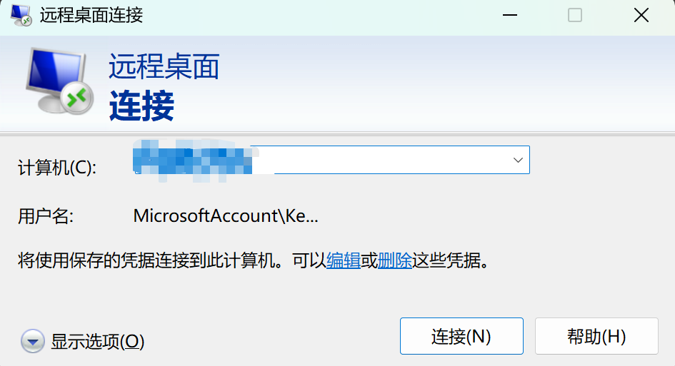

## 引言

为了能在学校（BUPT）外网环境、网络带宽有限、延迟比较大的情况下，能够比较流畅无卡顿的访问内网的Windows电脑，实现远程代码开发或者编写论文等需求，笔者根据互联网搜集到的一些关于微软RDP的知识进行了梳理，总结了一个配置指南，如果你的**WIndows**电脑访问远程桌面的时候比较卡顿，不妨参照本文的一些配置、一步一步的进行优化，可以显著提高在网络受限的条件下远程桌面的访问流畅度、帮你优化远程桌面使用的体验。在优化Windows远程桌面的时候需要注意下面几点：

1. 客户端与服务端的操作系统都是Windows。
2. 客户端使用微软自带的远程服务软件。
    
    
    
3. 本文仅涉及网络受限下的远程桌面的体验改善，默认你已经基本了解了微软远程桌面的使用，以及如何在外网访问内网的远程桌面。

## 配置方案推荐

### 服务端配置

- 在被远程的电脑上主要是可以进入本地组策略编辑器与注册表编辑器进行配置，这里主要是参考了知乎上的一篇文章进行配置。
    
    需要注意的是，`你需要在完成下面的配置之后重启电脑才生效`。
    
    1. 找到计算机配置->管理模板->Windows组件->[远程桌面服务](https://zhida.zhihu.com/search?content_id=218369546&content_type=Article&match_order=1&q=%E8%BF%9C%E7%A8%8B%E6%A1%8C%E9%9D%A2%E6%9C%8D%E5%8A%A1&zhida_source=entity)->远程桌面会话主机->远程会话环境。下面这几个打开，有效提高rdp性能。
        
        
        
    2. 找到计算机配置->管理模板->Windows组件->远程桌面服务->远程桌面会话主机->连接。rdp协议同时使用[udp](https://zhida.zhihu.com/search?content_id=218369546&content_type=Article&match_order=1&q=udp&zhida_source=entity)和[tcp](https://zhida.zhihu.com/search?content_id=218369546&content_type=Article&match_order=1&q=tcp&zhida_source=entity)。有效增加网络稳定性和传输速率。
        
        
        
    3. 打开 注册表编辑器 输入 `计算机\HKEY_LOCAL_MACHINE\SYSTEM\CurrentControlSet\Control\Terminal Server\WinStations` 敲回车
        
        
        
        在空白处右键->新建->DWORD（32位）值，命名为[`DWMFRAMEINTERVAL`](https://zhida.zhihu.com/search?content_id=218369546&content_type=Article&match_order=1&q=DWMFRAMEINTERVAL&zhida_source=entity)
        
        双击刚添加的这一项，基数选择为十进制，数值数据填写15，限制60 FPS。
        
        
        
        以下是`DWMFRAMEINTERVAL`（十进制）与远程桌面帧率限制的对应关系表格：
        
        | **DWMFRAMEINTERVAL（十进制数值数据）** | **远程桌面帧率（fps）** | **说明** |
        | --- | --- | --- |
        | 15 | 60 | 每秒 60 帧（高流畅度，对硬件和网络要求高） |
        | 30 | 30 | 每秒 30 帧（平衡流畅度与资源消耗，默认值） |
        | 60 | 15 | 每秒 15 帧（低资源消耗，适合网络 / 设备较差场景） |
        | 120 | 8 | 每秒约 8 帧（极端低消耗，仅用于弱网 / 老旧设备） |
        
        ### **补充说明**
        
        - 帧率计算公式：`帧率 = 1000 / DWMFRAMEINTERVAL`（单位：毫秒，系统通过该值控制画面更新间隔）。
        - 数值越小，帧率越高，但对 **网络带宽、设备性能（本地 / 远程）** 的要求也越高；数值越大，帧率越低，卡顿感可能增加，但网络 / 设备压力会显著降低。
        - 实际效果需结合网络延迟、设备配置等因素综合判断，建议通过 “小步调整 + 测试” 找到最优值。

### 客户端配置

Windows的远程桌面客户端有一些设置可以直接进行配置，包括显示的色彩、体验等设置，一般来说将显示色彩、体验拉到最低，能显著提升网络受限下远程桌面的使用体验，但是除了这些在客户端直接配置，还能够将这个远程桌面保存为一个.`rdp`文件，打开这个文件，我们能够解锁更多的配置。

- 在连接远程桌面之前进入显示与体验tab页面将对网络要求高的配置关闭。
    
    
    
- 另存为远程连接为一个`RDP`文件
    
    
    
- 用记事本打卡`RDP`文件, 并进行配置。
    
    
    
- RDP（远程桌面协议）配置项对应的功能说明表格，按 “显示设置”“网络与传输”“设备重定向”“性能优化”“安全与认证”“其他配置” 分类：
    
    
    | **配置分类** | **配置项名称** | **当前值** | **功能说明** |
    | --- | --- | --- | --- |
    | **一、显示设置** | `screen mode id` | `i:1` | 远程桌面显示模式：`1`为 “窗口模式”，`2`为 “全屏模式”，当前使用窗口化显示。 |
    |  | `use multimon` | `i:0` | 多显示器支持：`0`禁用多屏，`1`启用，当前仅用单显示器显示远程桌面。 |
    |  | `desktopwidth` | `i:1900` | 远程桌面宽度：设置为 1900 像素，决定远程画面的横向尺寸。 |
    |  | `desktopheight` | `i:1080` | 远程桌面高度：设置为 1080 像素，决定远程画面的纵向尺寸（当前为 1900×1080 分辨率）。 |
    |  | `session bpp` | `i:15` | 远程桌面颜色深度：`15`代表 15 位色（低色彩模式），减少色彩数据传输，适配弱网。 |
    |  | `winposstr` | `s:0,3,0,0,2560,1600` | 窗口位置与尺寸：`0,3`为窗口样式，`0,0`为左上角坐标，`2560,1600`为窗口宽高（适配本地屏幕）。 |
    | **二、网络与传输** | `compression` | `i:2` | 数据压缩等级：`2`为 “高压缩模式”，优先减少传输数据量（需消耗少量 CPU），适合弱网。 |
    |  | `connection type` | `i:1` | 网络类型适配：`1`为 “低速网络模式”，系统自动降低画面更新频率，优先保障鼠标 / 键盘响应。 |
    |  | `networkautodetect` | `i:0` | 自动检测网络：`0`禁用自动检测，需手动设置网络类型（当前已手动设为低速模式）。 |
    |  | `bandwidthautodetect` | `i:1` | 带宽自动适配：`1`启用，系统根据实时带宽调整数据传输策略，避免超出网络承载。 |
    | **三、设备重定向** | `redirectprinters` | `i:0` | 本地打印机重定向：`0`禁用，不将本地打印机映射到远程桌面，减少打印相关数据传输。 |
    |  | `redirectlocation` | `i:0` | 位置信息重定向：`0`禁用，不将本地设备的位置信息同步到远程桌面。 |
    |  | `redirectcomports` | `i:0` | 串口设备重定向：`0`禁用，不映射本地串口（如老式设备接口）到远程桌面。 |
    |  | `redirectsmartcards` | `i:1` | 智能卡重定向：`1`启用，将本地智能卡（如加密 U 盾）映射到远程桌面，用于身份认证。 |
    |  | `redirectwebauthn` | `i:1` | WebAuthn 设备重定向：`1`启用，映射本地 WebAuthn 设备（如安全密钥）到远程，支持无密码登录。 |
    |  | `redirectclipboard` | `i:1` | 剪贴板重定向：`1`启用，允许本地与远程之间复制粘贴文本 / 文件（弱网下可能占用带宽）。 |
    |  | `redirectposdevices` | `i:0` | POS 设备重定向：`0`禁用，不映射本地 POS 设备（如刷卡机）到远程桌面。 |
    |  | `drivestoredirect` | `s:`（空值） | 本地驱动器重定向：空值表示 “不重定向任何本地驱动器”（如 C 盘、U 盘），避免大容量文件传输占用带宽。 |
    | **四、性能与视觉优化** | `smart sizing` | `i:1` | 智能缩放：`1`启用，自动调整远程桌面尺寸以适配本地窗口 / 屏幕，避免画面拉伸模糊。 |
    |  | `audiocapturemode` | `i:0` | 音频捕获：`0`禁用，不将远程桌面的音频传输到本地，减少音频数据流。 |
    |  | `videoplaybackmode` | `i:0` | 视频播放优化：`0`禁用，弱网下关闭视频专用优化（避免视频帧占用过多带宽），转为静态画面优先。 |
    |  | `disable wallpaper` | `i:1` | 禁用壁纸：`1`启用，不加载远程桌面的壁纸，减少图像数据传输。 |
    |  | `allow font smoothing` | `i:0` | 字体平滑（抗锯齿）：`0`禁用，不优化字体边缘（减少字体渲染数据，弱网下更流畅）。 |
    |  | `allow desktop composition` | `i:0` | 桌面合成（Aero 效果）：`0`禁用，关闭远程桌面的透明 / 动画特效，降低 GPU 负载。 |
    |  | `disable full window drag` | `i:1` | 禁用窗口全拖：`1`启用，拖动远程窗口时仅显示边框（不实时渲染整个窗口），减少动态数据传输。 |
    |  | `disable menu anims` | `i:1` | 禁用菜单动画：`1`启用，关闭远程桌面的菜单展开 / 收起动画，减少动画渲染数据。 |
    |  | `disable themes` | `i:1` | 禁用主题：`1`启用，不加载远程桌面的视觉主题（用基础样式），降低资源消耗。 |
    |  | `disable cursor setting` | `i:1` | 禁用鼠标特效：`1`启用，不加载远程桌面的自定义鼠标指针（如阴影、异形指针），减少鼠标渲染数据。 |
    |  | `bitmapcachepersistenable` | `i:1` | 持久位图缓存：`1`启用，将远程常用图形（如按钮、边框）缓存到本地，下次无需重复传输（弱网下可减少卡顿）。 |
    | **五、安全与认证** | `authentication level` | `i:2` | 认证级别：`2`为 “连接前认证”，远程连接前先验证账号密码，提升安全性。 |
    |  | `prompt for credentials` | `i:0` | 手动输入凭据：`0`禁用，连接时不弹出密码输入框（通常结合保存的凭据使用）。 |
    |  | `negotiate security layer` | `i:1` | 安全层协商：`1`启用，系统自动与远程服务器协商最优安全协议（如 TLS），保障传输安全。 |
    |  | `enablerdsaadauth` | `i:0` | RDS AAD 认证：`0`禁用，不使用 Azure AD 账号登录远程桌面，用本地 / 域账号登录。 |
    | **六、其他配置** | `keyboardhook` | `i:2` | 键盘钩子：`2`为 “仅远程应用钩子”，确保远程应用的快捷键（如 Ctrl+C）正常生效，不影响本地键盘操作。 |
    |  | `enableworkspacereconnect` | `i:0` | 工作区重连：`0`禁用，断开连接后不保留远程工作区状态，下次连接重新加载。 |
    |  | `remoteappmousemoveinject` | `i:1` | 远程应用鼠标注入：`1`启用，优化远程应用中的鼠标移动响应速度，减少操作延迟。 |
    |  | `audiomode` | `i:0` | 音频模式：`0`为 “不重定向音频”，与`audiocapturemode`配合，完全关闭远程音频传输。 |
    |  | `autoreconnection enabled` | `i:1` | 自动重连：`1`启用，网络中断后自动尝试重新连接远程桌面，无需手动操作。 |
    |  | `remoteapplicationmode` | `i:0` | 远程应用模式：`0`禁用，以 “完整桌面” 模式连接，而非单独打开远程应用（如仅打开 Excel）。 |
    |  | `alternate shell` | `s:`（空值） | 替代 Shell：空值表示使用远程系统默认的桌面 Shell（如 Windows 桌面），不指定自定义启动程序。 |
    |  | `shell working directory` | `s:`（空值） | Shell 工作目录：空值表示使用远程 Shell 的默认工作目录，不自定义启动路径。 |
    |  | `gatewayhostname` | `s:`（空值） | 网关地址：空值表示不通过远程桌面网关连接，直接连接目标服务器（当前连接`10.29.188.120`）。 |
    |  | `gatewayusagemethod`等网关相关配置 | `i:4`/`i:4`/`i:0` | 网关使用策略：均为 “不使用网关” 的配置（因`gatewayhostname`为空，网关功能未启用）。 |
    |  | `promptcredentialonce` | `i:0` | 单次凭据提示：`0`禁用，不限制凭据输入次数（连接失败时可重新输入）。 |
    |  | `gatewaybrokeringtype` | `i:0` | 网关代理类型：`0`为默认值，因网关未启用，此配置暂不生效。 |
    |  | `use redirection server name` | `i:0` | 重定向服务器名：`0`禁用，不使用自定义服务器名进行设备重定向。 |
    |  | `rdgiskdcproxy` | `i:0` | KDC 代理：`0`禁用，不通过 KDC 代理服务器进行身份认证（适用于普通网络环境）。 |
    |  | `kdcproxyname` | `s:`（空值） | KDC 代理名称：空值表示不指定 KDC 代理服务器，与`rdgiskdcproxy`配合使用。 |
    |  | `full address` | `s:xx.xx.xx.xx`  | 远程服务器地址：指定要连接的远程桌面服务器 IP（当前为`xx.xx.xx.xx`，无额外端口则用默认 3389 端口）。 |
- 窗口模式配置：主要是配置窗口模式下的大小，远程分辨率等等，固定远程桌面的分辨率能显著改善卡顿的情况。
    
    Windows上的远程桌面如果要固定远程分辨率，并用近乎全屏的方式显示只能用这种方式，因为进入全屏模式后远程分辨率会调整到与客户端机器的分辨率一致。
    
    与 “窗口设置” 直接相关的核心配置如下（聚焦窗口显示、尺寸、位置与适配，非全部 60 项）：
    
    1. **显示模式**：`screen mode id:i:1`，远程桌面以 “窗口模式” 运行（非全屏）；
    2. **多屏支持**：`use multimon:i:0`，仅用单显示器显示远程桌面，不启用多屏扩展；
    3. **远程分辨率**：`desktopwidth:i:1900`+`desktopheight:i:1080`，远程桌面内部分辨率为 1900×1080；
    4. **窗口位置 / 大小**：`winposstr:s:0,3,0,0,2560,1600`，窗口左上角坐标 (0,0)，窗口实际尺寸 2560×1600（适配本地屏幕）；
    5. **智能缩放**：`smart sizing:i:1`，远程画面会自动缩放以匹配窗口大小，避免拉伸模糊。
    
    窗口模式的显示效果如下：
    
    
    
- 以下是整合了网络条件不好时的 RDP 核心优化配置及`session bpp`详细参数的综合表格，涵盖配置分类、建议值、作用、优先级及色彩 / 带宽细节：
    
    
    | **配置分类** | **配置项名称** | **优化建议值** | **色彩描述（仅 session bpp）** | **带宽消耗（相对值）** | **作用说明（核心目的）** | **适用场景（补充说明）** | **优先级** |
    | --- | --- | --- | --- | --- | --- | --- | --- |
    | **显示基础** | `desktopwidth` | `i:1280` | - | - | 降低远程分辨率宽度（减少 40%+ 像素传输） | 所有弱网场景，优先减少画面数据量 | 最高 |
    |  | `desktopheight` | `i:720` | - | - | 降低远程分辨率高度（配合宽度，保持 16:9 比例） | 配合宽度调整，避免画面拉伸 | 最高 |
    |  | `session bpp` | `i:8` 或 `i:15` | 8 位：256 色（基础色彩）15 位：32768 色（低色彩） | 8 位：最低15 位：较低 | 减少色彩数据传输，降低带宽压力 | 8 位：纯文本（代码、文档）15 位：兼顾基础色彩与带宽 | 最高 |
    |  | `session bpp`（扩展值） | `i:16` | 65536 色（中低色彩） | 中等 | 比 15 位略丰富，带宽消耗略增 | 网络略好，需简单图表等基础色彩场景 | 中 |
    |  | `session bpp`（扩展值） | `i:24`/`i:32` | 24 位：1600 万色（真彩色）32 位：1600 万色 + Alpha 通道 | 24 位：较高32 位：最高 | 色彩丰富，带宽消耗大 | 仅适合高带宽场景（设计、视频） | 低 |
    | **网络适配** | `connection type` | `i:1` | - | - | 强制 “低速网络模式”，系统自动减少动态画面传输 | 所有弱网场景，优先保障操作响应 | 高 |
    |  | `compression` | `i:2` | - | - | 启用高压缩，牺牲少量 CPU 换 60%+ 数据量减少 | 弱网下优先开启，平衡带宽与设备负载 | 高 |
    |  | `networkautodetect` | `i:1` | - | - | 开启自动检测网络，动态调整传输策略 | 网络波动大时，自动适配带宽变化 | 高 |
    | **非必要禁用** | `redirectclipboard` | `i:0` | - | - | 关闭剪贴板共享，避免大文件 / 图片占用带宽 | 无需复制粘贴时，减少额外数据传输 | 中 |
    |  | `redirectsmartcards` | `i:0` | - | - | 关闭智能卡重定向（非认证场景） | 不使用智能卡认证时 | 中 |
    |  | `redirectwebauthn` | `i:0` | - | - | 关闭 WebAuthn 设备重定向（非必要安全设备） | 不使用安全密钥时 | 中 |
    |  | `videoplaybackmode` | `i:0` | - | - | 关闭视频优化，转为静态画面优先传输 | 弱网下无需视频播放时 | 中 |
    | **性能优化** | `disable wallpaper` | `i:1` | - | - | 禁用壁纸，减少图像数据 | 所有场景壁纸时，降低静态图像传输量 | 中 |
    |  | `disable full window drag` | `i:1` | - | - | 拖动窗口仅显示边框，减少动态渲染数据 | 减少窗口操作时的实时画面传输 | 中 |
    |  | `bitmapcachepersistenable` | `i:1` | - | - | 保留位图缓存，常用图形本地存储，减少重复传输 | 弱网下减少重复图形数据传输 | 中 |
    | **其他** | `smart sizing` | `i:1` | - | - | 保持智能缩放，避免画面拉伸导致额外渲染 | 适配本地屏幕，减少拉伸带来的额外数据 | 低 |
    |  | `autoreconnection enabled` | `i:0` | - | - | 网络极差时关闭自动重连，避免重连请求占带宽 | 网络频繁中断时，减少重连的带宽消耗 | 低 |

### **核心说明：**

1. 弱网条件下优先调整 “最高 / 高优先级” 项，尤其是核心是通过**降低分辨率、压缩数据、禁用非必要传输**减少带宽占用；
2. `session bpp`根据弱网首选 8 或 15 位，需根据色彩需求选择（纯文本用 8 位，基础色彩用 15 位）；
3. 所有配置需结合实际场景取舍（如必须使用剪贴板则保留`redirectclipboard:i:1`）。

## 参考资料

1. https://zhuanlan.zhihu.com/p/586057141
2. https://www.reddit.com/r/sysadmin/comments/fv7d12/pushing_remote_fx_to_its_limits/