- **Zabbix Proxy**：用于从被监控的主机收集数据，并将这些数据转发给 Zabbix Server。这有助于减轻 Zabbix Server 的负载，特别是在大规模监控环境中。Zabbix Proxy 还可以作为网络隔离的桥梁，缓存数据以应对网络不稳定的情况。
- **Zabbix Agent**：运行在被监控的主机上，用于收集本地的监控数据，并将数据发送给 Zabbix Server 或 Zabbix Proxy。
- **Zabbix Sender**：用于主动向 Zabbix Server 发送数据。
- **MySQL 数据库**：用于存储 Zabbix Proxy 的相关数据，包括监控数据和配置信息。
- **NPS Client (npc)**：用于网络穿透，允许内部网络的主机通过公网服务器访问内部服务。

`zabbix_get` 本身不能直接 “主动执行” shell 命令，但它可以 **获取 Zabbix Agent 执行 shell 命令后的结果**—— 前提是在 Agent 端提前配置好对应的 “自定义监控项”（通过 `UserParameter` 定义）。

### **具体逻辑：**

`zabbix_get` 的作用是 “向 Agent 请求指定监控项的数据”，而 Agent 可以被配置为：当收到某个监控项（Key）的请求时，执行一段 shell 命令 / 脚本，并将命令的输出结果返回给 `zabbix_get`。

简单说：`zabbix_get` 不直接运行 shell 命令，而是 “触发 Agent 执行预设的 shell 命令”，再获取结果。

### **实现步骤（示例）：**

1. **在被监控的 “盒子”（Agent 端）配置自定义参数**：编辑 Zabbix Agent 的配置文件（如 `zabbix_agentd.conf`），添加一行 `UserParameter`，定义一个 “监控项 Key” 与 “shell 命令” 的映射：
    
    ```jsx
    # 格式：UserParameter=键名,要执行的shell命令
    UserParameter=custom.ping.baidu,ping -c 3 baidu.com | grep "packet loss"  # 执行ping百度3次，提取丢包率
    ```
    
    保存后重启 Zabbix Agent，使配置生效。
    
2. **在安装了 zabbix_get 的机器上查询结果**：执行 `zabbix_get` 命令，指定 Agent 的 IP 和上述定义的 Key，即可获取 shell 命令的输出：
    
    ```jsx
    zabbix_get -s 10.0.0.1  # 目标盒子的IP
               -k "custom.ping.baidu"  # 刚才定义的Key
    ```
    

输出结果可能类似：`3 packets transmitted, 3 received, 0% packet loss, time 2002ms`（即 ping 命令的执行结果）。

### **注意事项：**

- Agent 执行的 shell 命令权限由 Agent 进程的运行用户（如 `zabbix` 用户）决定，若命令需要 root 权限，需配置`sudo`或调整权限。
- 命令的输出需符合 Zabbix 的格式要求（通常是单行文本或数值，避免复杂格式导致解析错误）。
- 这种方式本质是 “通过监控项间接执行 shell 命令”，而非 `zabbix_get` 直接运行命令，适合预先定义好的探测逻辑（如你需要的 PING、CURL 等）。

结合你的 “全网拨测” 需求：可以在各地盒子的 Agent 中，通过 `UserParameter` 预先定义好 PING、CURL、DNS 等 shell 命令的监控项，然后用 `zabbix_get` 从中心节点向各地盒子发送请求，获取这些命令的执行结果，从而实现全网探测。

### **核心目标**

想做一个「全国（甚至全球）范围的网络拨测工具」，功能类似现有的 `http://itops.jd.com/#/nettools/pingtools`（可能是个基础 ping 工具），但要更全面 —— 支持多种常用网络探测命令（PING、CURL、DNS、TELNET 等），能从分布在各地的「盒子」（推测是部署在不同地区的监控节点 / 设备）出发，一键发起探测并获取结果。

### **现有基础**

目前这些「盒子」已经通过 **ZABBIX** 进行监控数据上报（即盒子的状态、基础数据会同步到 ZABBIX 系统）。

### **实现思路的考虑**

为了实现上述拨测功能，计划：

1. 在所有全球分布的「盒子」上部署一个 **AGENT**（代理程序），让这个 AGENT 能执行 PING、CURL、DNS、TELNET 等探测命令；
2. 封装这些功能时，考虑复用现有工具：比如用 ZABBIX 的 `zabbix_get` 工具（ZABBIX 中用于从服务器主动获取代理数据的工具），或者 Prometheus 的 `Blackbox Exporter`（专门用于黑盒探测的组件，支持多种网络协议探测）。

简单说就是：基于现有的全球分布的「盒子」和 ZABBIX 监控基础，新增一个能从各地盒子主动发起多种网络探测（PING / 域名解析 / 端口连通性等）的工具，方便做全网范围的网络状态验证，实现方式考虑复用 zabbix_get 或 Blackbox 这类成熟工具。

## **反向监控**

监控中心在内网 而agent在外网 、这通常被称为 **"反向监控"** 或 **"外网设备监控"** 场景。让我详细解释这种情况的工作原理和典型应用场景。

### 为什么会出现这种需求？

**监控中心在内网，Agent在外网** 的场景通常出现在以下情况：

1. **企业总部监控分支/门店**：总部有完善的监控系统，需要监控各个门店的服务器、POS机等设备。
2. **监控云资源**：公司内部监控系统需要监控公有云上的云主机、数据库等资源。
3. **远程办公设备监控**：需要监控员工居家办公的电脑或服务器。
4. **IoT设备监控**：监控分布在不同地点的物联网设备。

---

### 技术实现方案

由于Agent在外网，监控中心在内网，**最大的挑战是内网的监控中心无法主动连接外网的Agent**。以下是几种解决方案：

### 方案一：使用 Zabbix Proxy（推荐）

这是最标准、最稳定的做法。

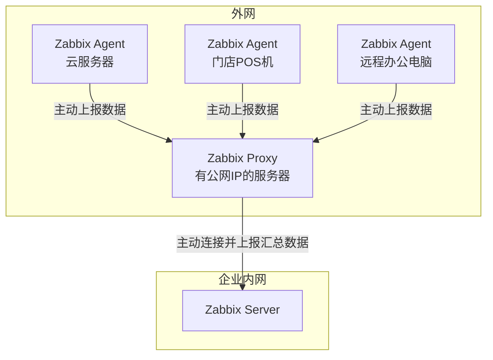

**工作流程**：

1. 在外网部署一台 **Zabbix Proxy**（需要公网IP）
2. 所有外网的 **Zabbix Agent** 配置为**主动模式**，主动向Proxy上报数据
3. **Zabbix Proxy** 主动连接内网的 **Zabbix Server** 并上报汇总数据
4. Zabbix Server 处理数据、触发告警

**优势**：

- Zabbix 原生支持，稳定性高
- Proxy 可以缓存数据，网络中断时不会丢失数据
- 安全性好，只需Proxy能访问Server即可

### 方案二：使用 NPS/NPC 建立隧道

这种方式通过隧道"拉回"外网Agent。

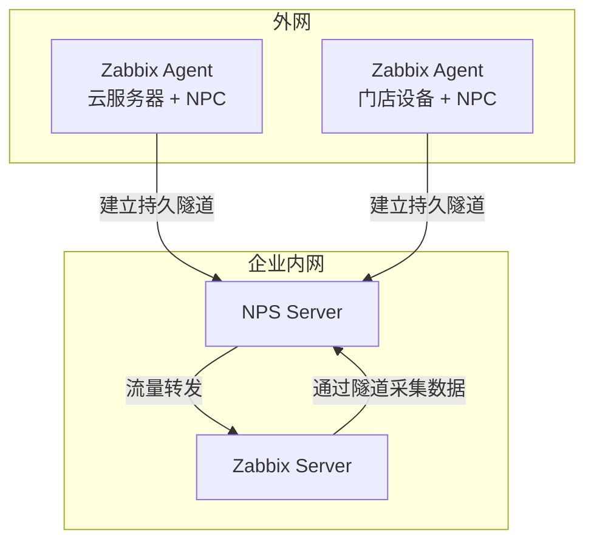

**工作流程**：

1. 在内网部署 **NPS 服务端**
2. 在外网Agent机器上运行 **NPC 客户端**，与NPS建立隧道
3. Zabbix Server 通过隧道地址访问外网的Agent

**配置示例**：

- 为云服务器Agent创建隧道：`nps云端口:10050` → `外网AgentIP:10050`
- Zabbix Server 添加主机时，地址填写：`nps内网IP:nps云端口`

### 方案三：Agent完全主动模式

最简单的方案，但功能有限。

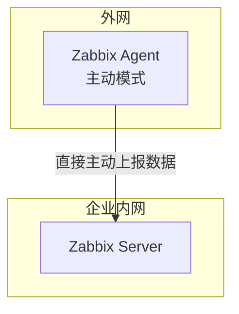

**配置要点**：

- Agent 配置文件中设置：
    
    ```
    ServerActive=zabbix-server-internal-ip:10051
    Hostname=唯一标识符
    
    ```
    
- 在Zabbix Server上创建主机时，`Host name` 要与Agent的`Hostname`一致

**限制**：

- Server 无法主动触发检查（如网络发现、自动注册）
- 某些监控项可能无法工作

---

### 实际场景对比

| 场景 | 推荐方案 | 理由 |
| --- | --- | --- |
| **监控多个云主机** | Zabbix Proxy | 集中管理，降低网络开销 |
| **监控少量远程设备** | Agent主动模式 | 简单直接，无需额外组件 |
| **网络环境复杂** | NPS/NPC隧道 | 穿透能力强，适应性好 |
| **安全性要求高** | Zabbix Proxy | Zabbix原生安全机制 |

### 总结

**监控中心在内网，Agent在外网是完全可行的**，关键在于解决连接方向的问题：

- **Zabbix Proxy**：企业级推荐，稳定可靠
- **NPS/NPC隧道**：灵活性强，适合复杂网络
- **Agent主动模式**：简单场景适用，配置便捷

选择哪种方案取决于你的具体需求：设备数量、网络环境、安全要求和维护成本。对于生产环境，我通常推荐 **Zabbix Proxy 方案**，因为它是Zabbix生态的原生组成部分，有最好的兼容性和支持。

## JDIT Zabbix数据采集方案

您说得对，完整的监控流程应该包括配置下发和主动采集。让我修正图表，添加Zabbix Server向Proxy下发采集配置的线路：

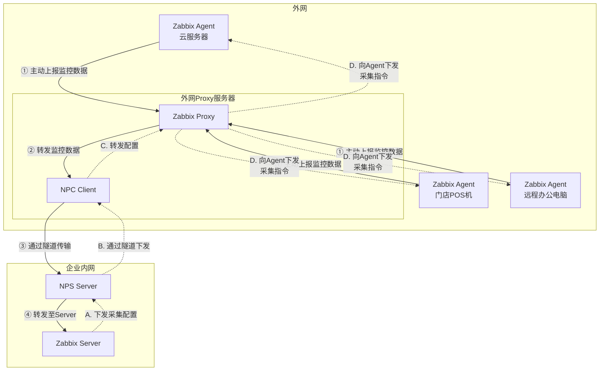

### 完整的数据流说明

**配置下发流程（虚线路径 A→B→C→D）：**

1. **A**: Zabbix Server 通过Web界面配置监控项后，向Proxy下发采集配置
2. **B**: NPS Server 通过已建立的隧道将配置指令转发给NPC
3. **C**: NPC 将配置指令传递给本地的Zabbix Proxy
4. **D**: Zabbix Proxy 将具体的采集任务下发给各个Zabbix Agent

**数据上报流程（实线路径 ①→②→③→④）：**

1. **①**: 各Zabbix Agent 执行采集任务，主动将监控数据上报给Zabbix Proxy
2. **②**: Zabbix Proxy 汇总和处理数据后，准备发送给Server
3. **③**: NPC 通过隧道将监控数据发送给NPS Server
4. **④**: NPS Server 将数据转发给Zabbix Server进行处理和存储

### 关键配置要点

要使这个双向通信正常工作，需要正确配置：

**Zabbix Proxy 配置：**

```
# 必须配置为主动模式，才能通过隧道连接Server
Server=内网NPS服务器IP:隧道端口
Hostname=外网Proxy唯一标识

```

**Zabbix Agent 配置：**

```
# 配置为主动模式，向Proxy上报数据
ServerActive=Proxy服务器IP
Hostname=设备唯一标识

```

**NPS 隧道配置：**

- 需要建立**双向TCP隧道**，确保配置下发和数据上报都能通过同一个隧道传输
- 隧道需要保持持久连接，避免频繁重连影响监控实时性

这样的架构确保了监控系统完整的闭环：既能下发监控配置，又能收集监控数据，完全满足了生产环境的需求。

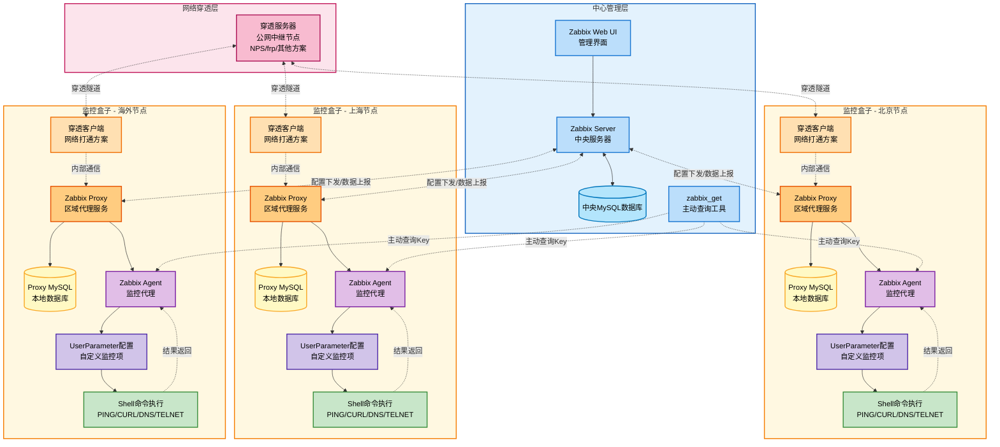

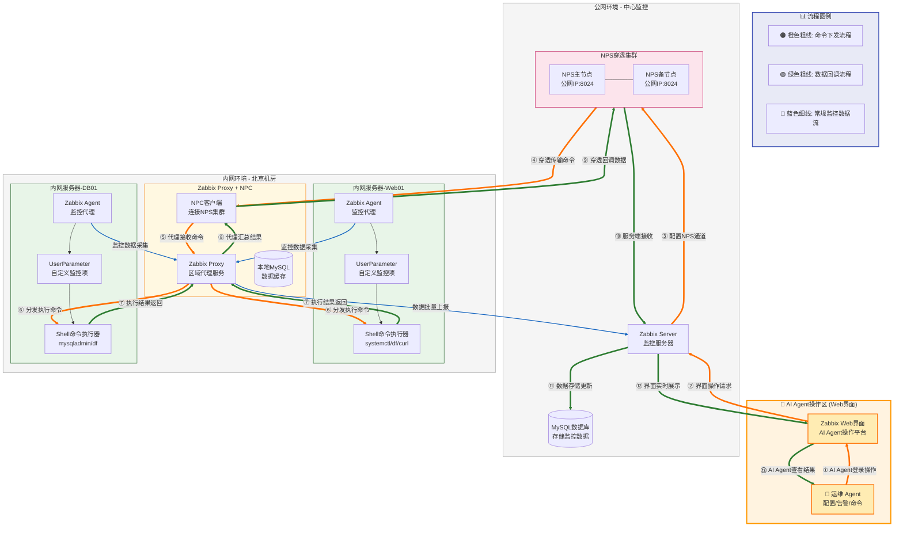

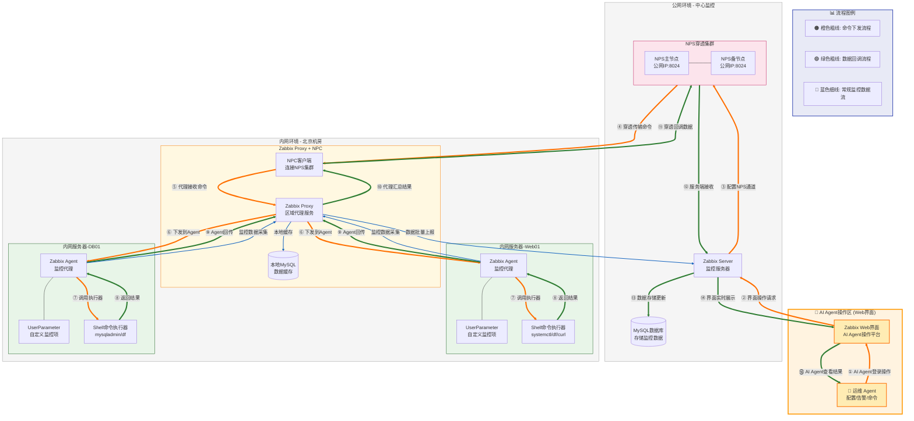

- **本地的 MySQL 缓存是属于 Zabbix Proxy 的。**

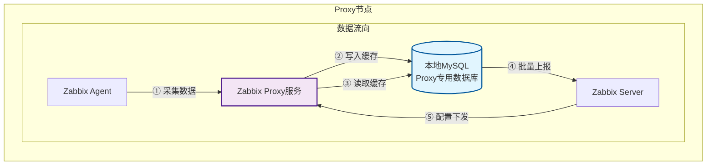

- IT监控盒子服务框架 ✅**被监控设备**（主机）需要单独部署和配置各自的 Agent
- zabbix proxy的大版本必须要和zabbix server版本一致，否则会导致出现zabbix server与zabbix proxy不兼容问题

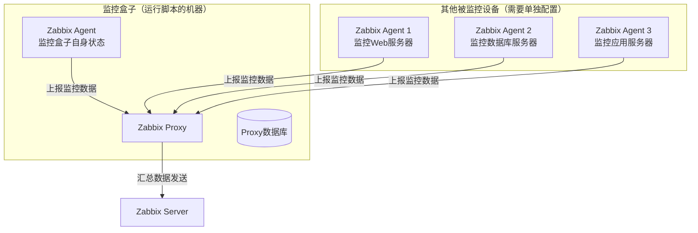

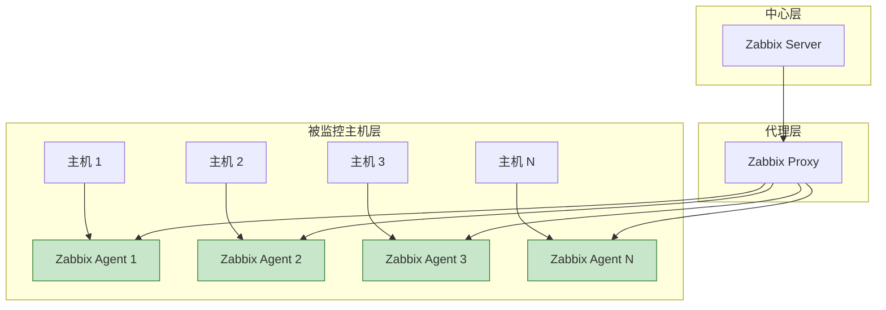

- 内网穿透ncp方案梳理

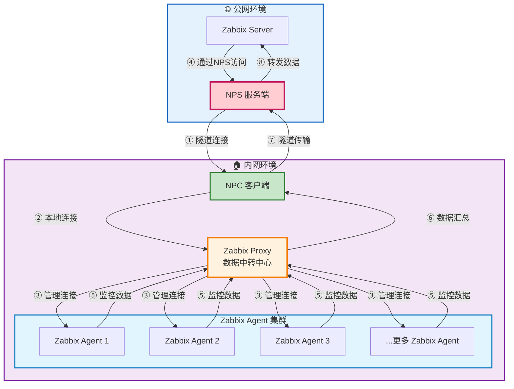