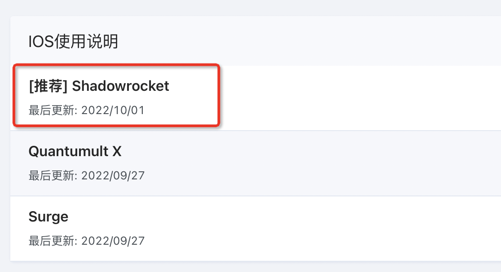

# Mac 电脑推荐安装

工具1：clash for windows（推荐）

工具2：Clash  verge

# iPhone 客户端推荐

这个客户端非常好，官方文档有美国 Apple ID下载完退出就好。



# Clash verge 配置 (clash for windows类似)


# mac终端使用proxy

mac命令行不能走proxy流量，需要如下配置：

cat ~/.bash_profile

```
# 开启代理
function proxy_on() {
    export no_proxy="localhost,127.0.0.1,localaddress,.localdomain.com"
    export http_proxy="http://127.0.0.1:7890"
    export https_proxy=$http_proxy
    # export all_proxy=socks5://127.0.0.1:7890 # or this line
    echo -e "\n"
    echo -e "\033[32m已开启代理\033[0m" # 设置颜色
}

# 关闭代理
function proxy_off(){
    unset http_proxy
    unset https_proxy
    unset all_proxy
    echo -e "已关闭代理"
}

```

开启：

命令行运行：proxy_on

关闭：

命令行运行：proxy_off
# WSL配置Proxy

```bash
# 开启代理
function proxy_on() {
    # 获取Windows主机IP（WSL2的网关）
    local win_host=$(cat /etc/resolv.conf | grep nameserver | awk '{print $2}')
    
    # 设置代理服务器地址为Windows主机IP
    export no_proxy="localhost,127.0.0.1,localaddress,.localdomain.com,$win_host"
    export http_proxy="http://$win_host:7890"  # 使用Windows主机IP
    export https_proxy=$http_proxy
    # export all_proxy=socks5://$win_host:7890  # 如果使用SOCKS5代理
    
    echo -e "\n"
    echo -e "\033[32m已开启代理\033[0m"
    echo -e "代理服务器: $http_proxy"
    echo -e "绕过代理: $no_proxy"
}

# 关闭代理
function proxy_off(){
    unset http_proxy
    unset https_proxy
    unset all_proxy
    echo -e "已关闭代理"
}
```