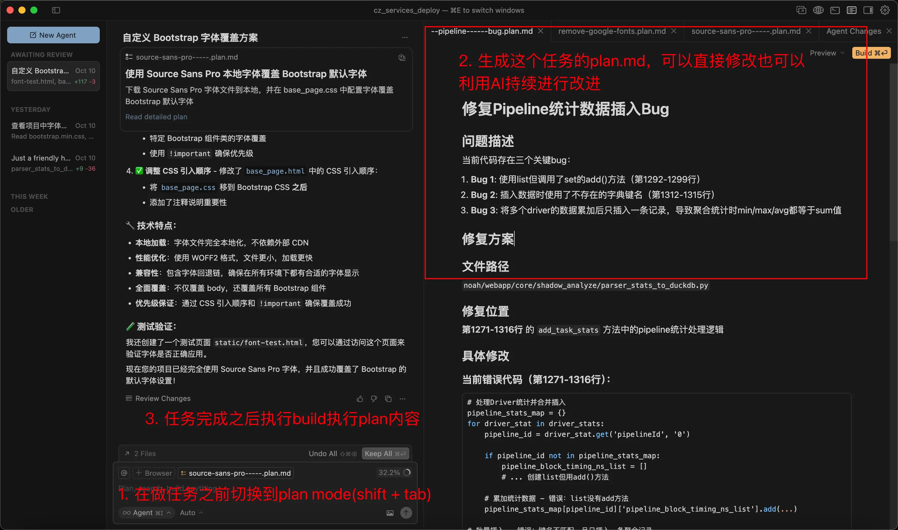

## 2025/10/11

我的mentor是我的贵人，他清晰的指出了我的不足：

1. 做东西、开发的时候一定要及时与他人沟通确认。
2. 写完东西之后，一定要把单元测试（特别是在重构代码的时候）写好。

cursor的Plan Mode体验是真的不错，在改bug做需求前先对齐颗粒度了算是。



有个tool tip 那些AI Agent可能无法直击通过dialog提供API Key等敏感信息，但是我们可以通过将敏感信息export到环境变量中，让LLM间接获取信息。

**推荐写法：**

```sql
grep -R --color=auto "XXX" .
```

**命令解释：**

- `grep`: 调用 grep 程序。
- `R`: 递归搜索当前目录 `.` 下的所有文件和子目录。
- `-color=auto`: 自动在终端输出中，将匹配到的 "XXX" 字符串高亮显示（通常是红色）。
- `"XXX"`: 你要搜索的目标字符串。
- `.`: 搜索的起始路径，这里代表当前目录。

## 2025/10/12

没事的话还是看看书，看看漫画好吧~

## 2025/10/15

**IT运维服务化，IT服务标准化、产品化、数智化，面向全集团员工和BGBU业务，以运营的方式交付IT服务，将企业IT从成本中心转化为服务中心和利润中心。**

- **IT统一运维平台：运管编排协同管控一体化IT运维平台**
  - 建设：ITOPS一体化运维平台，整合主动被动运维工具，提供资产管理，IT员工画像，云平台运维，服务台管理，融合集成三方管理系统，实现自动化流程作业，数字化运营分析，保障服务稳定性。
  - 成效：提升IT人员主动运维效率整体提升60%，累计服务10余万次，支撑自动化提效降本有序开展。

**方案设计需要结合[变更三板斧](http://xingyun.jd.com/shendeng/article/detail/30277?forumId=0&jdme_router=jdme%3A%2F%2Fweb%2F202206081297%3Furl%3Dhttp%3A%2F%2Fsd.jd.com%2Farticle%2F30277)，可以做到可监控、可灰度、可回滚**。方案设计完成之后，拉相关方（产品、上下游研发、测试等）进行评审（可以提前在京me上预约会议），评审通过给到项目排期。

SLA 在企业 IT 中是 **Service Level Agreement（服务级别协议）** 的缩写，核心是企业 IT 部门（或外部服务商）与业务部门（或客户）之间签订的、明确服务质量标准的契约性文档，用来定义 “IT 服务要达到什么水平” 以及 “未达标时如何处理”。

- 简单说，SLA 就是 IT 服务的 “质量说明书”，比如 “服务器全年故障停机时间不能超过 8.76 小时”“IT 工单需在 2 小时内响应”，本质是通过明确规则减少双方对服务质量的认知差异，保障业务稳定运行。
- `ASR` 是语音交互和语音处理系统中的核心组件，全称是 **Automatic Speech Recognition（自动语音识别）**，主要功能是将人类的语音信号转换为可被计算机处理的文本。

DevOps工具集合：https://devops.phodal.com/home

| **命令 / 符号** | **核心功能分类** | **具体作用说明**                                                       | **典型示例**                                                      |
| --------------------- | ---------------------- | ---------------------------------------------------------------------------- | ----------------------------------------------------------------------- |
| `echo`              | 文本输出工具           | 在终端打印指定内容，或配合重定向符号写入文件；默认自动换行                   | `echo "Hello"`（终端打印）、`echo "内容" >> file.txt`（追加到文件） |
| `>>`                | 输出重定向（追加）     | 将命令输出内容追加到文件末尾，不覆盖原有内容；文件不存在时自动创建           | `echo "新内容" >> notes.txt`                                          |
| `>`                 | 输出重定向（覆盖）     | 将命令输出内容写入文件，覆盖原有内容（清空文件后写入）；文件不存在时自动创建 | `echo "覆盖内容" > new.txt`                                           |
| `eval`              | 命令字符串执行工具     | 解析字符串中的变量、命令替换等，将结果作为命令执行                           | `eval "$(/opt/homebrew/bin/brew shellenv)"`（执行 brew 环境配置）     |

- Pydantic 是基于类型提示的 Python 数据验证库，可定义数据模型并自动验证类型、格式与约束。应用于 API 交互、配置解析、数据序列化及值对象实现等场景。

## 2025/10/17

**高效制定Rules⑥要素**

1.**请务必使用 Cursor 本身来起草您的 Cursor rules**

- 大语言模型（LLMs）非常擅长为其他大语言模型撰写内容。如果您不确定如何组织文档格式或编码上下文，请执行 “@folder/ generate a markdown file that describes the key file paths and definitions for commonly expected changes”。

2.**切勿在 Cursor rules 中声明身份（例如“您是精通 TypeScript 的资深前端工程师”）**

- 会与内置提示词赋予的身份产生冲突，导致智能体行为异常。

3.**避免尝试覆盖系统类似提示词指令**

- 类似“别添加注释”、“编码前先提问”、“勿删除未提及代码”的指令会直接破坏工具使用机制并干扰智能体运作。

4.**把你的模块规则和定制代码词术语描述清晰**

- 如同维基百科那样，将定制术语（如hint、spec是什么意思），这在智能体确定代码所需的关键上下文时能提供巨大助力。

5.**要意识到制定太多规则其实是个不好的做法**

- 这一点看似违反直觉，未来理想的代码库应该设计得足够清晰直观，AI 编程工具光靠基础功能就能完美胜任所有工作。

6.**减少使用否定性指令**

- 大模型更擅长遵循正向指令（“若遇\<此情况>，则\<执行此操作>”），而非单纯列出限制条件。

简单说：进程隔离让多个程序 “安全地共存在一个系统”，容器隔离让多个程序 “看起来像在各自的系统中运行”。

`::` 是 **方法引用（Method Reference）** 的语法符号，是 Java 8 引入的 Lambda 表达式的简化形式，用于直接引用已有的方法（或构造方法），让代码更简洁。

`::` 本质是 Lambda 表达式的 “语法糖”，当 Lambda 体仅调用一个已有方法时，用 `::` 引用该方法可以让代码更简洁、可读性更高。其核心是 “复用已有的方法逻辑”，避免重复编写 Lambda 表达式的调用代码。

```jsx
// Lambda 表达式
list.forEach(s -> System.out.println(s));

// 方法引用（引用 System.out 的 println 方法）
list.forEach(System.out::println);
```

Java 中的 `::` 是**方法引用（Method Reference）**，本质是 **Lambda 表达式的语法糖**——当 Lambda 体仅调用一个已存在的方法（无额外逻辑）时，用 `::` 直接引用该方法，简化代码书写。

**核心前提**

方法引用的使用必须满足：**目标场景是函数式接口**（只有一个抽象方法的接口，如 `Runnable`、`Function`、`Consumer` 等），且引用的方法签名（参数类型、返回值）需与函数式接口的抽象方法签名**兼容**（参数数量、类型匹配，返回值一致或兼容）。

**4 种常见用法（含格式+示例）**

1. 静态方法引用（最常用）

- **格式**：`类名::静态方法名`
- **场景**：Lambda 体直接调用某个类的静态方法，且 Lambda 的参数全部传给该静态方法。

```java
import java.util.function.Function;

public class Test {
    public static void main(String[] args) {
        // Lambda 写法：将 String 转为 Integer（调用 Integer.parseInt 静态方法）
        Function<String, Integer> lambda = s -> Integer.parseInt(s);

        // 方法引用写法（简化）
        Function<String, Integer> methodRef = Integer::parseInt;

        System.out.println(methodRef.apply("123")); // 输出 123
    }
}

```

2. 实例方法引用（对象级）

- **格式**：`对象实例::实例方法名`
- **场景**：Lambda 体调用某个**具体对象**的实例方法，Lambda 参数传给该实例方法。

```java
import java.util.function.Supplier;

public class Test {
    public static void main(String[] args) {
        String str = "Hello";

        // Lambda 写法：调用 str 的 length() 方法
        Supplier<Integer> lambda = () -> str.length();

        // 方法引用写法（简化）
        Supplier<Integer> methodRef = str::length;

        System.out.println(methodRef.get()); // 输出 5
    }
}

```

3. 类级实例方法引用（特殊）

- **格式**：`类名::实例方法名`
- **场景**：Lambda 有**至少一个参数**，且第一个参数是该实例方法的**调用者**，后续参数是实例方法的参数。

```java
import java.util.function.BiFunction;

public class Test {
    public static void main(String[] args) {
        // Lambda 写法：调用 String 的 compareTo 方法（s1 是调用者，s2 是参数）
        BiFunction<String, String, Integer> lambda = (s1, s2) -> s1.compareTo(s2);

        // 方法引用写法（简化）
        BiFunction<String, String, Integer> methodRef = String::compareTo;

        System.out.println(methodRef.apply("a", "b")); // 输出 -1（a < b）
    }
}

```

4. 构造器引用（创建对象）

- **格式**：`类名::new`
- **场景**：Lambda 体仅用于创建对象，且 Lambda 参数全部传给该类的构造器。

```java
import java.util.List;
import java.util.function.Supplier;

public class Test {
    public static void main(String[] args) {
        // Lambda 写法：创建 ArrayList 实例
        Supplier<List<String>> lambda = () -> new ArrayList<>();

        // 方法引用写法（简化）
        Supplier<List<String>> methodRef = ArrayList::new;

        List<String> list = methodRef.get();
        list.add("Java");
        System.out.println(list); // 输出 [Java]
    }
}

```

核心总结

1. 方法引用是 Lambda 的“简化版”，仅当 Lambda 体无额外逻辑、仅调用一个已有方法时使用；
2. 关键是**方法签名兼容**（参数、返回值与函数式接口抽象方法匹配）；
3. 4 种用法覆盖绝大多数场景，重点掌握「静态方法引用」和「构造器引用」。

以下是 **Java 方法引用（::）的 5 个简单最佳实践**，均贴近日常开发高频场景，核心原则是「简化代码、提升可读性」，同时避开常见误区：

**最佳实践 1：集合 Stream 遍历（forEach）—— 优先用实例方法引用**

**场景**：遍历集合时，仅调用元素的实例方法（无额外逻辑），比如打印、字符串处理、对象属性获取。

**优势**：比 Lambda 少写冗余参数，代码更简洁直观。

```java
import java.util.Arrays;
import java.util.List;

public class BestPractice1 {
    public static void main(String[] args) {
        List<String> fruits = Arrays.asList("apple", "banana", "cherry");

        // ❶ 遍历打印（实例方法引用：System.out::println）
        // 替代 Lambda：fruits.forEach(f -> System.out.println(f));
        fruits.forEach(System.out::println);

        // ❷ 遍历并调用元素的实例方法（比如字符串去空格+转大写）
        // 替代 Lambda：fruits.forEach(f -> System.out.println(f.trim().toUpperCase()));
        // 注意：若需多个方法调用，仍用 Lambda（方法引用仅支持单个方法）
        fruits.forEach(f -> System.out.println(f.trim().toUpperCase()));

        // ❸ 遍历并调用自定义对象的实例方法（比如 Fruit 类的 showName）
        List<Fruit> fruitObjects = Arrays.asList(new Fruit("apple"), new Fruit("banana"));
        // 替代 Lambda：fruitObjects.forEach(f -> f.showName());
        fruitObjects.forEach(Fruit::showName);
    }

    static class Fruit {
        private String name;
        public Fruit(String name) { this.name = name; }
        public void showName() { System.out.println("Fruit: " + name); }
    }
}

```

**最佳实践说明**：

- 当 `forEach` 的逻辑仅为「调用元素的一个实例方法」或「调用静态方法（如打印）」时，直接用方法引用；
- 若需多个方法串联（如 `trim()` + `toUpperCase()`），保留 Lambda 更清晰，避免强行拆分方法。

**最佳实践 2：集合 Stream 转换（map）—— 静态/实例方法引用二选一**

**场景**：批量转换集合元素（如 String → Integer、Object → 属性值），仅调用一个转换方法。

**优势**：语义更明确，避免 Lambda 的冗余参数。

```java
import java.util.Arrays;
import java.util.List;
import java.util.stream.Collectors;

public class BestPractice2 {
    public static void main(String[] args) {
        List<String> strNums = Arrays.asList("1", "2", "3");
        List<String> names = Arrays.asList("alice", "bob", "charlie");

        // ❶ 静态方法引用：String → Integer（调用 Integer.valueOf 静态方法）
        // 替代 Lambda：strNums.stream().map(s -> Integer.valueOf(s))
        List<Integer> nums = strNums.stream()
                .map(Integer::valueOf) // 简洁明了，直接体现「字符串转整数」
                .collect(Collectors.toList());
        System.out.println(nums); // [1,2,3]

        // ❷ 实例方法引用：String → 大写（调用 String.toUpperCase 实例方法）
        // 替代 Lambda：names.stream().map(s -> s.toUpperCase())
        List<String> upperNames = names.stream()
                .map(String::toUpperCase) // 语义清晰：「字符串转大写」
                .collect(Collectors.toList());
        System.out.println(upperNames); // [ALICE, BOB, CHARLIE]

        // ❸ 实例方法引用：对象 → 属性值（调用 User::getName 实例方法）
        List<User> users = Arrays.asList(new User("alice"), new User("bob"));
        List<String> userNames = users.stream()
                .map(User::getName) // 直接获取对象属性，无需冗余参数
                .collect(Collectors.toList());
    }

    static class User {
        private String name;
        public User(String name) { this.name = name; }
        public String getName() { return name; }
    }
}

```

**最佳实践说明**：

- 转换逻辑是「静态方法」→ 用「类名::静态方法」（如 `Integer::valueOf`）；
- 转换逻辑是「元素的实例方法」→ 用「类名::实例方法」（如 `String::toUpperCase`）；
- 比 Lambda 更易读，尤其是方法名本身有语义（`valueOf`、`toUpperCase`）时。

**最佳实践 3：集合排序（sorted）—— 用实例方法引用简化比较**

**场景**：集合元素排序（自然排序或按属性排序），仅调用比较方法。

**优势**：避免 Lambda 中重复的参数名（如 `(a,b) -> a.compareTo(b)`），代码更简洁。

```java
import java.util.Arrays;
import java.util.List;
import java.util.Comparator;

public class BestPractice3 {
    public static void main(String[] args) {
        List<String> names = Arrays.asList("bob", "alice", "charlie");
        List<User> users = Arrays.asList(new User("bob", 25), new User("alice", 22));

        // ❶ 自然排序（String 实现了 Comparable，调用 compareTo 实例方法）
        // 替代 Lambda：names.stream().sorted((a, b) -> a.compareTo(b))
        List<String> sortedNames = names.stream()
                .sorted(String::compareTo) // 直接引用比较方法，简洁
                .collect(Collectors.toList());
        System.out.println(sortedNames); // [alice, bob, charlie]

        // ❷ 按对象属性排序（配合 Comparator.comparing + 方法引用）
        // 替代 Lambda：users.stream().sorted((u1, u2) -> u1.getAge() - u2.getAge())
        List<User> sortedUsers = users.stream()
                .sorted(Comparator.comparingInt(User::getAge)) // 按年龄排序，语义明确
                .collect(Collectors.toList());
        System.out.println(sortedUsers.get(0).getName()); // alice（22岁）
    }

    static class User {
        private String name;
        private int age;
        public User(String name, int age) { this.name = name; this.age = age; }
        public int getAge() { return age; }
        public String getName() { return name; }
    }
}

```

**最佳实践说明**：

- 自然排序（元素实现 Comparable）→ 直接用「类名::compareTo」；
- 按对象属性排序 → 用 `Comparator.comparingXXX` + 「对象::属性 getter」，比手动写 Lambda 比较逻辑更简洁，且不易出错（如避免 `u1.getAge() - u2.getAge()` 的溢出问题）。

**最佳实践 4：构造器引用简化对象创建（批量/单例）**

**场景**：批量创建对象（如 Stream 中转换）或简化单对象创建，构造器参数与 Lambda 参数完全匹配。

**优势**：避免重复的 `new Xxx(...)`，代码更简洁，语义更聚焦「创建对象」。

```java
import java.util.Arrays;
import java.util.List;
import java.util.stream.Collectors;

public class BestPractice4 {
    public static void main(String[] args) {
        List<String> userNames = Arrays.asList("alice", "bob", "charlie");

        // ❶ 批量创建对象：String → User（构造器参数为 String）
        // 替代 Lambda：userNames.stream().map(name -> new User(name))
        List<User> users = userNames.stream()
                .map(User::new) // 直接引用构造器，清晰体现「用名字创建用户」
                .collect(Collectors.toList());

        // ❷ 简化集合创建（JDK 自带类的构造器引用）
        // 替代 Lambda：() -> new ArrayList<>()
        List<String> emptyList = Arrays.stream(new String[0])
                .collect(Collectors.toCollection(ArrayList::new)); // 比 new ArrayList<>() 更简洁

        // ❸ 单对象创建（函数式接口传参）
        // 替代 Lambda：() -> new User("default")
        User defaultUser = createUser(User::new, "default");
    }

    // 自定义方法：接收构造器引用 + 参数，创建对象
    private static User createUser(UserConstructor constructor, String name) {
        return constructor.create(name);
    }

    // 函数式接口：匹配 User(String name) 构造器
    @FunctionalInterface
    interface UserConstructor {
        User create(String name);
    }

    static class User {
        private String name;
        public User(String name) { this.name = name; }
    }
}

```

**最佳实践说明**：

- 批量创建对象（如 Stream.map）时，优先用构造器引用，避免重复写 `new Xxx(...)`；
- 当构造器参数与函数式接口的抽象方法参数完全匹配时，用 `类名::new` 是最优选择（语义明确，无冗余）。

**最佳实践 5：避免过度使用（反例）—— 仅当无额外逻辑时用**

**场景**：Lambda 体有额外逻辑（如 null 判断、计算、分支）时，禁止用方法引用。

**优势**：避免为了用方法引用而拆分代码，导致可读性下降。

```java
import java.util.Arrays;
import java.util.List;
import java.util.stream.Collectors;

public class BestPractice5 {
    public static void main(String[] args) {
        List<String> strNums = Arrays.asList("1", "2", null, "3");

        // ❌ 反例：Lambda 体有 null 判断，不能用方法引用
        // 错误写法：strNums.stream().map(Integer::valueOf) → 会空指针
        // 正确写法：保留 Lambda，明确处理额外逻辑
        List<Integer> nums = strNums.stream()
                .map(s -> s != null ? Integer.valueOf(s) : 0) // 有 null 处理，必须用 Lambda
                .collect(Collectors.toList());
        System.out.println(nums); // [1,2,0,3]

        // ❌ 反例：Lambda 体有分支逻辑，不能用方法引用
        // 错误写法：strNums.stream().map(String::length) → 会空指针
        List<Integer> lengths = strNums.stream()
                .map(s -> s == null ? 0 : s.length()) // 有分支，必须用 Lambda
                .collect(Collectors.toList());
    }
}

```

**最佳实践说明**：

- 方法引用的核心是「无额外逻辑、仅调用一个已有方法」；
- 若 Lambda 体需要处理 null、分支、计算等，必须保留 Lambda，否则会导致代码晦涩或异常（如空指针）。

**核心最佳实践总结**

1. **优先在 Stream API 中使用**：遍历（forEach）、转换（map）、排序（sorted）是方法引用的「黄金场景」，简洁又易读；
2. **语义优先**：当方法名本身有明确语义（如 `toUpperCase`、`compareTo`、`valueOf`）时，用方法引用比 Lambda 更易理解；
3. **不强行使用**：Lambda 体有额外逻辑（判断、计算、分支）时，坚决保留 Lambda；
4. **配合函数式接口**：自定义方法参数为函数式接口（如 `Function`、`Consumer`）时，传入方法引用比 Lambda 更直观。

这些实践均符合「简单、高效、可读性优先」的原则，日常开发中优先覆盖前 4 个场景，避开第 5 个误区即可。

## 2025/10/20

**OTP 令牌核心内容简要总结**

1. **基本概念**：OTP（One-Time Password，一次性密码）是通过 “预共享密钥 + 特定算法”，在用户端与服务器端同步生成的单次有效动态密码，可解决静态密码易泄露、复用的安全问题，核心实现有 HOTP 和 TOTP 两大标准。
2. **两大核心标准**：
   - **HOTP**：全称 HMAC-Based One-Time Password（基于 HMAC 算法的一次性密码），以 “计数器” 为同步因子，每次验证后计数器递增，适用于硬件令牌（如银行 U 盾），遵循 RFC 4226 标准。
   - **TOTP**：全称 Time-Based One-Time Password（基于时间的一次性密码），以 “30 秒时间窗口” 为同步因子，允许 ±1 窗口误差应对延迟，适用于手机 APP（如谷歌验证器），遵循 RFC 6238 标准。
3. **使用场景**：用于高安全需求场景，包括账号登录二次验证（如企业 OA、网银）、敏感操作授权（转账、改密码）、硬件设备访问（配合堡垒机管理服务器）、线下验证（快递取件码）。
4. **关键组件**：需服务器端（生成密钥、验证 OTP）、用户端（软件 APP / 硬件令牌）、同步机制（HOTP 靠计数器对齐，TOTP 靠时间同步）三方配合。
5. **安全优势**：动态性（用后失效）、密钥不传输（仅初始化同步）、防重放攻击（验证后更新同步因子）。

- **正向代理、反向代理、隧道代理对比表**

  通过 “日常场景例子” 和 “核心特征”，清晰区分三种代理的本质差异，表格如下：

  | **代理类型**                                                                    | **核心作用（代理方）**                                   | **简单生活 / 技术例子**                                                                                                        | **数据流向（清晰版）** | **典型适用场景** |
  | ------------------------------------------------------------------------------------- | -------------------------------------------------------------- | ------------------------------------------------------------------------------------------------------------------------------------ | ---------------------------- | ---------------------- |
  | **正向代理**                                                                    | 替「客户端」转发请求，突破访问限制                             | 1. 公司内网禁止直接访问谷歌，电脑配置代理服务器（如 Shadowsocks），通过代理访问谷歌；                                                |                              |                        |
  | 2. 校园网限制访问校外视频站，用校园代理服务器中转后观看。                             | 客户端 → 正向代理服务器 → 目标服务器（如谷歌）               | 客户端突破网络限制（访问境外网站、绕过内网封锁）、隐藏客户端真实 IP。                                                                |                              |                        |
  | **反向代理**                                                                    | 替「服务器端」接收请求，保护后端                               | 1. 访问淘宝（`www.taobao.com`），请求先到淘宝的反向代理服务器（如 Nginx），再由代理转发到后端不同的商品 / 订单服务器；             |                              |                        |
  | 2. 小公司只有 1 台公网 IP，用反向代理将请求分别转发到内网的网站服务器、数据库服务器。 | 客户端 → 反向代理服务器 → 后端目标服务器（如淘宝商品服务器） | 服务器负载均衡（分发请求到多台后端）、隐藏后端服务器真实 IP、统一入口（如用 1 个域名对应多台服务）。                                 |                              |                        |
  | **隧道代理**                                                                    | 打通「两端网络」，建立专属通道                                 | 1. 出差时想访问家里的 NAS（仅内网可连），在 NAS 和手机上安装隧道工具（如 frp），通过隧道代理穿透家庭路由器防火墙，手机直接访问 NAS； |                              |                        |
  | 2. 远程办公时，用隧道代理连接公司内网的开发服务器，就像在公司本地操作一样。           |                                                                |                                                                                                                                      |                              |                        |

## 2025/10/22

当前我的人生哲学：护肤、健身、学习、投资。

跨域的本质是 **浏览器的 “同源策略” 限制**，当浏览器发起的请求满足 “协议、域名、端口三者中任意一个与当前页面不同” 时，就会触发跨域。

**跨域的 “触发主体” 是浏览器：**

- 需要注意：**跨域是浏览器的限制，不是服务器的限制**。比如你用 Postman 或 curl 直接请求 `http://b.com/api`（从 `a.com` 页面跨域请求的地址），能正常拿到响应；但在 `a.com` 页面里用 JS（如 axios、fetch）发同样的请求，浏览器会拦截响应并报跨域错误。
- 简单总结：只要 “请求地址” 和 “当前页面地址” 的协议、域名、端口有一个不一样，浏览器就会判定为跨域并拦截。

| **解决方案**    | **核心原理**                 | **关键实现（一句话）**                                      | **核心优缺点**                             | **适用场景**          |
| --------------------- | ---------------------------------- | ----------------------------------------------------------------- | ------------------------------------------------ | --------------------------- |
| **CORS**        | 服务器设响应头，允许指定域名跨域   | 服务器端：`Access-Control-Allow-Origin: 前端域名`               | ✅ 标准兼容好、支持所有请求方法；❌ 需服务器配置 | 前后端分离项目（主流）      |
| **代理服务器**  | 前端请求代理，代理转发到目标服务器 | 开发：webpack devServer 配 proxy；生产：Nginx 反向代理            | ✅ 前端无改动、支持所有场景；❌ 需部署代理       | 开发 / 生产通用（推荐生产） |
| **JSONP**       | 利用 `<script>` 标签无跨域限制  | 前端传回调名，服务器返回 `回调名(数据)`                         | ✅ 兼容 IE；❌ 仅支持 GET、有 XSS 风险           | 老项目兼容（如 IE8/9）      |
| **postMessage** | HTML5 API，前端页面间跨域传消息    | 发送 `postMessage(数据, 目标域名)`，接收监听 `message` 事件 | ✅ 适用于跨窗口 /iframe；❌ 仅前端通信           | 跨窗口 /iframe 交互         |
| **WebSocket**   | 协议本身无跨域限制，持久连接       | 前端 `new WebSocket('wss://目标地址')`                          | ✅ 实时性强；❌ 需服务器支持该协议               | 聊天、实时通知等场景        |

## 2025/10/23

**A2A协议核心组件**

- **Agent Card**：一个公开的 JSON 文件（通常托管在 `/.well-known/agent.json`），用于描述该 Agent 的名称、功能、技能（Skill）、URL、认证方式等信息，便于客户端进行「服务发现」和「能力匹配」。
- [**Task**](https://zhida.zhihu.com/search?content_id=256470041&content_type=Article&match_order=1&q=Task&zhida_source=entity)：表示一个具体的工作单元，具有唯一 ID，并可以在多轮交互中不断更新状态。
- **Message**：客户端和 Agent 之间互通时用的消息对象（"user" 或 "agent" 角色），其中可以包含多种类型的 **Part**（如文本部分、文件部分、数据部分等）
- **Artifact**：由 Agent 在执行任务过程中生成的输出结果。它与 Message 的差别在于，Artifact 通常是「结果物」或产物，而 Message 常用于「对话或指令」。
- **Push Notification**：可选功能，如果 Agent 支持 `pushNotifications`，就可以向客户端指定的 URL 主动发起任务进度更新，而无需客户端轮询。
- **Streaming**：如果 Agent 支持 `streaming` 功能，就可以在处理某个任务时，通过 `tasks/sendSubscribe` 使用 SSE 进行分段或实时地输出状态与结果。

**核心参与者**

- **用户 (User)**: 发起请求的最终用户或自动化服务
- **A2A客户端**: 代表用户向远程智能体发起请求的应用或智能体
- **A2A服务端**: 实现A2A协议HTTP端点的AI智能体或智能体系统

| **对比维度** | **A2A协议**        | **MCP协议**           |
| ------------------ | ------------------------ | --------------------------- |
| **主要用途** | AI智能体间对等协作       | AI模型与工具/资源连接       |
| **交互特点** | 状态化、多轮对话、协商式 | 无状态、单次调用、事务性    |
| **应用场景** | 智能体委托、协作项目管理 | 函数调用、API查询、数据获取 |
| **复杂度**   | 支持复杂、动态交互       | 结构化、可预测的输入输出    |

https://www.ibm.com/cn-zh/think/topics/agent2agent-protocol

寡头铁律:

[](https://m.wendangwang.com/doc/e8835b2fccacaa895f0efbaa75d6749002c1f8f0?show_loading=0&push_animated=1&webview_progress_bar=1&theme=light)

**米歇尔斯基于对欧洲社会民主党的观察得出结论，这些政党尽管宣称代表工人阶级利益，但在实际运作中领导层逐渐脱离群众，决策过程被精英小团体垄断。这种集中化趋势并非偶然，而是组织发展的必然结果。组织规模扩大后，协调复杂性增加，需要专业管理者和快速决策机制，这自然导致权力向核心成员倾斜。同时，普通成员往往缺乏参与动力或专业知识，倾向于依赖领导者，进一步巩固寡头结构。心理因素同样关键，人类天性倾向于服从权威，领导者通过个人魅力或组织资源维持控制，形成自我强化的循环。米歇尔斯的研究方法结合了历史分析和实证观察，他考察了19世纪末至20世纪初的多个政党和工会案例，如德国社会民主党和意大利社会主义运动，这些组织从草根民主演变为由少数官僚主导的体系。**

## 2025/10/27

| **场景分类** | **必须存在__init__.py 的情况**                                           | **具体说明**                                                                                                                                   | **适用 Python 版本**         |
| ------------------ | ------------------------------------------------------------------------------ | ---------------------------------------------------------------------------------------------------------------------------------------------------- | ---------------------------------- |
| 标识包身份         | 需将目录识别为可导入的包（非命名空间包）                                       | Python 3.3 之前的版本中，目录必须包含__init__.py 才能被视为 “包”，否则无法通过 `import`导入其中的模块。                                          | Python < 3.3                       |
| 控制通配导入       | 需要通过 `__all__`定义 `from package import *`的暴露范围                   | 若未定义__init__.py 或未在其中声明 `__all__`，`from package import *`会导入包内所有可见模块 / 成员（可能不符合预期），因此需用__init__.py 规范。 | 所有版本（若需控制通配导入）       |
| 执行初始化逻辑     | 包被导入时需要自动执行初始化代码（如设置全局变量、加载配置、预导入子模块）     | 若没有__init__.py，初始化逻辑无法触发，会导致包状态异常（如缺少版本号、核心功能未导入）。                                                            | 所有版本（若有初始化需求）         |
| 简化导入路径       | 需要隐藏内部目录结构，提供简洁的外部导入接口（如将深层模块成员提升到包根目录） | 例如需通过 `from package import func`直接导入 `package.sub.module.func`时，必须在__init__.py 中显式声明导入逻辑，否则用户需手动导入深层路径。    | 所有版本（若需简化导入）           |
| 兼容旧版本         | 代码需要兼容 Python 3.3 之前的版本                                             | 即使在 Python 3.3 + 中可省略，但若需支持旧版本，必须包含__init__.py 以确保包能被正确识别。                                                           | 所有版本（需兼容 Python < 3.3 时） |

Claude 的记忆管理体系设计了三个不同的作用域，理解它们的定位是高效使用的关键。

| **内存类型** | **文件路径**  | **核心定位与策略建议**                                         | **使用场景示例**                                                                                                                                                                                                                                                        |
| ------------------ | ------------------- | -------------------------------------------------------------------- | ----------------------------------------------------------------------------------------------------------------------------------------------------------------------------------------------------------------------------------------------------------------------------- |
| 用户内存           | ~/.claude/CLAUDE.md | 个人编码哲学: 定义全局、跨所有项目的个人偏好。这是你的“数字 DNA”。 | - 个人代码风格（如：使用 2 空格缩进）- 习惯的 Git Commit 格式- 个人常用工具的快捷指令                                                                                                                                                                                         |
| 项目内存           | ./CLAUDE.md         | 团队共同语言: 定义项目范围内的规范和标准，是团队协作的基石。         | - 项目技术栈与架构图- API 设计规范与数据结构- 团队共享的部署与测试流程                                                                                                                                                                                                        |
| 项目本地内存       | ./CLAUDE.local.md   | 个人项目配置 (已废弃): 存放个人在特定项目中的临时或敏感配置。        | - 本地沙箱环境的 URL- 个人的测试数据或 API 密钥注意: 官方已不推荐使用此文件，建议通过在 .gitignore 中忽略特定文件，并使用[@import](https://zhida.zhihu.com/search?content_id=261190939&content_type=Article&match_order=1&q=%40import&zhida_source=entity) 功能导入的方式替代。 |

## 2025/10/28

**何谓“高质量PRD”？**

「PRD」作为产品经理达成目标实现的「方案外化」和「沟通语言」，需要满足以下条件：

- **方向正确：**围绕「真需求」/「价值」，此部分可理解为对用户需求或问题点的挖掘和识别，一般为BRD承载（第一讲的「更好的评审业务BRD[更好评审供应链业务方案的三个模型](https://joyspace.jd.com/pages/4ZXLvoRooQoGTJrQlp2z)」可复习）。若是忽略角色职责边界，对需求和价值的「挖掘」，又是另外一个专项：业务调研，支撑方法包括查看行业资料、进行业务访谈、一线调研与实操、竞品调研等方式，此处不再展开；
- **「高价值解决方案」的「建模」呈现：**方向正确后 ，需要给出「高价值解决方案」，并对齐进行建模，好的模型抽象和实现，需要满足用户体验良好、模型抽象清晰、边界清晰、流程清晰等要求。即，能承载从现实世界目标-解决方案到计算机世界实现的**双向转化**。在下面第三部分中，给出一种使用UML面向对象建模的方法，可在后续工作中不断实战演练；
- **考虑你文档的不同「用户」：**不要把PRD文档的用户，狭义的限定在「实现研发」（具体写代码实现的研发）这一个角色身上，要知道PRD文档不仅仅是用于研发写代码，而是产品经理达成整个需求团队价值交付的沟通工具。这里面包含你的协同产品、研发（架构、主研发、执行开发研发）、测试（主测试、模块测试）、UED（交互设计、视觉设计）、项目经理等角色，每个角色关注的视角和内容都有所不同。拉长了时间看，PRD文档还是团队内部形成的**「知识库」**，新人产品及其他模块产品等角色，需要通过这些文档，获得关于物理世界的还原、系统能力抽象和沉淀的图谱构建等信息。
- **高效的「沟通」：**PRD文档作为达成目标的辅助沟通工具，需要有**「高可读性」**，即，让你文档的用户/或者说协同方，**在最小的时间内获得最多最有效的信息。**
- 面向对象分许完整实现过程

现实世界→对象世界的实现，简单的对应关系

|            | 现实世界                                   | 人                                        | 事         | 规则              | 物           |
| ---------- | ------------------------------------------ | ----------------------------------------- | ---------- | ----------------- | ------------ |
| 建模       | 从「现实世界」到「业务模型」               | 参与者                                    | 用例       | 业务场景/用例场景 | 业务对象模型 |
| 概念       | 从「业务模型」到「概念模型」               | 用户                                      | 边界类     | 控制类            | 实体类       |
| 设计       | 从「概念模型」到「设计模型」               | Role                                      | ·操作界面 |                   |              |
| ·系统接口 | 计算机程序或控制程序，例如工作流、算法体等 | 数据库表、XML文档或其他带有持久化特征的类 |            |                   |              |

| **阶段**  | **核心工作**                     | **具体内容**                                                                                                                                                                                                               | **必须输出内容**                                                            | **目的**                                               |
| --------------- | -------------------------------------- | -------------------------------------------------------------------------------------------------------------------------------------------------------------------------------------------------------------------------------- | --------------------------------------------------------------------------------- | ------------------------------------------------------------ |
| 1. 定方向       | 明确目标与解决方案                     | 1. 挖掘真实业务目标 / 问题，避免将 “解决方案”（如加承运商信息）当作目标；2. 从公司、系统、业务流程三角度识别所有利益相关方；3. 对比收入、成本等维度，确定高价值解决方案。                                                      | 1. 业务目标 / 问题说明书；2. 利益相关方清单及诉求表；3. 解决方案对比分析报告      | 确保设计围绕真实业务需求，**不偏离核心方向**           |
| 2. 搭框架       | 构建功能与非功能框架                   | 1. 功能框架：用 “用例技术” 明确参与者及操作（优先用例图，文档可用用户故事），聚焦 “目标层用例”；2. 非功能框架：明确监管硬性要求、系统承载量（用户量 / 业务量）等性能需求。                                                   | 1. 用例图（或用户故事集）；2. 非功能需求规格说明书（含性能、监管要求）            | 解决需求 “宽度” 问题，避免遗漏关键功能，为技术实现提供基础 |
| 3. 做细节       | 梳理流程、操作与信息结构               | 1. 业务流程：用流程图梳理正常流程 + 异常流程（重点关注实物多 / 少 / 损 / 错、人员 / 设备异常、系统退出等）；2. 业务操作：用状态图明确对象状态及转变规则；3. 信息结构：用 E-R 图定义信息内容及数量关系（如订单与包裹）。          | 1. 业务流程图（含异常流程分支）；2. 核心对象状态转换图；3. E-R 图（信息结构图）   | 理顺业务逻辑，避免界面设计漏洞，为画原型打基础               |
| 4. 界面设计落地 | 交互设计 + 视觉设计（含 UED 简要协作） | 1. 简要协作：与 UED 团队同步阶段 1-3 核心业务逻辑，确认需求对齐；2. 交互设计：复杂场景画「交互流程图」，遵循反馈、防错、撤回、容错四大原则；3. 视觉设计：采用用户易懂语言（如 “非作业时长” 替代 “间接工时”），匹配业务场景。 | 1. 需求对齐确认单（简化版）；2. 交互流程图（复杂场景）+ 交互设计稿；3. 视觉设计稿 | 确保界面贴合业务需求，交互流畅、用户易懂，高效完成设计落地   |

**用户故事集：把 “谁做什么” 拆成 “口语化需求 + 验收标准”**

用户故事不用画图，是文字片段，核心格式是 **“作为 [角色]，我想 [做某个操作]，以便 [达成什么目的]”**，再补充 “验收标准”（做到什么程度算合格），适合写进 PRD 或跟团队同步细节。

**「即时配订单仓内生产」用户故事集示例**

| **序号** | **用户故事（核心需求）**                                                                            | **验收标准（判断是否达标）**                                                                                                                                              |
| -------------- | --------------------------------------------------------------------------------------------------------- | ------------------------------------------------------------------------------------------------------------------------------------------------------------------------------- |
| 1              | 作为称重员，我想在 WMS 系统里给即时配订单的生鲜品称重并录入重量，以便后续拣货员按实际重量打包。           | 1. 系统能筛选 “即时配生鲜订单”；2. 录入重量时支持小数点（如 2.5kg），且有 “重量范围提示”（如超过 5kg 弹窗警告）；3. 称重后，订单状态自动变成 “已称重”，同步给拣货员页面。 |
| 2              | 作为拣货员，我想在 WMS 里按 “已称重的即时配订单” 列表拣货，拣完后直接打包，以便减少来回切换操作的时间。 | 1. 页面能筛选 “仅已称重的即时配订单”；2. 拣货时点击 “已拣货”，系统自动跳转到 “打包确认” 页面；3. 打包后点击 “完成”，订单状态变成 “待出库”，同步到仓储主管的监控页面。 |

[`settings.json`](https://zhida.zhihu.com/search?content_id=263169558&content_type=Article&match_order=1&q=settings.json&zhida_source=entity) 文件是通过分层设置配置 Claude Code 的官方机制：

- **用户设置** 在 `~/.claude/settings.json` 中定义，适用于所有项目。
- **项目设置** 保存在您的项目目录中：
- `.claude/settings.json` 用于检入源代码控制并与团队共享的设置
- `.claude/settings.local.json` 用于不检入的设置，对个人偏好和实验很有用。Claude Code 会在创建时配置 git 忽略 `.claude/settings.local.json`。
- 对于 Claude Code 的企业部署，还支持**企业托管策略设置**。这些设置优先于用户和项目设置。系统管理员可以将策略部署到：
- macOS: `/Library/Application Support/ClaudeCode/managed-settings.json`
- Linux 和 WSL: `/etc/claude-code/managed-settings.json`
- Windows: `C:\ProgramData\ClaudeCode\managed-settings.json`

```jsx
{
  "permissions": {
    "allow": [
      "Bash(npm run lint)",
      "Bash(npm run test:*)",
      "Read(~/.zshrc)"
    ],
    "deny": [
      "Bash(curl:*)",
      "Read(./.env)",
      "Read(./.env.*)",
      "Read(./secrets/**)"
    ]
  },
  "env": {
    "CLAUDE_CODE_ENABLE_TELEMETRY": "1",
    "OTEL_METRICS_EXPORTER": "otlp"
  }
}
```

## 2025/10/29

**自旋（Spin）是一种 “循环等待” 操作**：当线程 / 进程需要获取某个资源（如锁、共享数据）但暂时无法获取时，它不会立即进入阻塞状态（放弃 CPU 使用权），而是通过**重复检查资源状态**的方式持续等待，直到资源可用。

- **减少上下文切换开销：**线程 / 进程的 “阻塞 - 唤醒” 过程需要操作系统介入（从用户态切换到内核态），开销较大（涉及保存 / 恢复线程状态、调度其他任务等）。
- **自旋与 CLH 队列的结合：**在 CLH 锁中，自旋的对象是**前一个节点的状态**（而非锁本身）。

| **分类**     | **具体维度** | **详细说明**                                                                                |
| ------------------ | ------------------ | ------------------------------------------------------------------------------------------------- |
| **基础定义** | 全称               | Craig-Landin-Hagersten Queue，由三位计算机科学家提出的自旋锁队列结构                              |
|                    | 核心定位           | 用于多线程 / 进程同步的**公平排队机制**，是实现自旋锁的经典底层结构                         |
| **核心结构** | 队列类型           | 隐式链表（无显式 `next`指针），通过 “节点引用前一个节点” 形成逻辑队列                         |
|                    | 节点组成           | 每个节点包含两个核心信息：1. 自身的等待状态（如 `locked`，标记是否占用锁）；2. 前一个节点的引用 |
| **核心机制** | 自旋对象           | 线程 / 进程不直接自旋 “锁本身”，而是自旋**前一个节点的状态**                              |
|                    | 排队逻辑           | 新竞争锁的节点通过原子操作加入队尾，仅等待前序节点释放锁，按入队顺序执行                          |
| **关键特性** | 公平性             | 严格遵循 “先来先服务（FIFO）”，避免线程 / 进程饥饿问题                                          |
|                    | 空间效率           | 节点仅存储状态和前节点引用，无额外全局队列维护开销，空间占用低                                    |
|                    | 缓存友好性         | 相邻节点内存地址接近，自旋操作可高效利用 CPU 缓存，减少缓存失效损耗                               |
| **适用场景** | 原始适用范围       | 线程级同步（如多核 CPU 下的线程自旋锁）                                                           |
|                    | 扩展适用范围       | 可改进用于**进程级公平调度**（需将节点存储在进程共享内存，保证状态可见性）                  |

| **特性** | **`@Resource`**            | **`@Autowired`**                   |
| -------------- | ---------------------------------- | ------------------------------------------ |
| 所属规范       | Java EE 规范（JSR-250）            | Spring 框架自定义注解                      |
| 默认匹配规则   | 先按名称（name），再按类型（type） | 仅按类型（type）                           |
| 指定名称的方式 | 通过自身 `name` 属性            | 需要配合 `@Qualifier` 注解的 `value` |
| 支持的注入位置 | 字段、setter 方法                  | 字段、setter 方法、构造方法                |

[spec-kit也只有支持并行的claude code可以玩转。否则就是痛苦的等待。](https://zhuanlan.zhihu.com/p/1959040296479339345)

[](https://zhuanlan.zhihu.com/p/1959040296479339345)

## 2025/10/30

**单元测试的优先级**

1. **最高优先级**：服务层（业务逻辑核心，决定系统功能正确性）。
2. **次高优先级**：工具层（复用性高，错误影响范围广）。
3. **中等优先级**：控制器层（验证接口契约，确保前后端交互正确）。
4. **按需测试**：数据访问层（核心操作需测试，简单 CRUD 可结合集成测试覆盖）。
